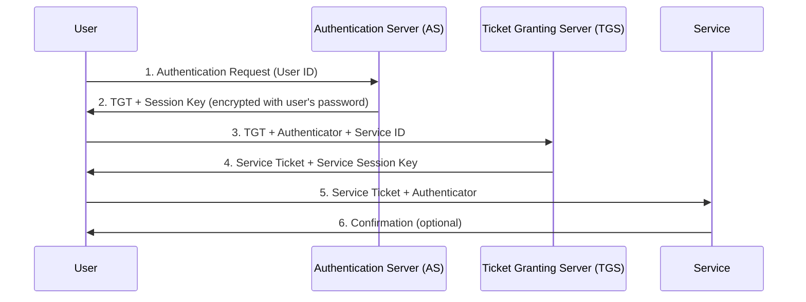

# Kerberos Authentication

## Introduction to Kerberos

Kerberos is a network authentication protocol designed to provide strong authentication for client/server applications using secret-key cryptography. Named after the three-headed dog from Greek mythology, Kerberos was developed at MIT in the 1980s to secure network services in their Project Athena.

Kerberos has become the standard authentication protocol in enterprise environments, particularly those using Microsoft Active Directory, which implements a version of Kerberos as its primary authentication method.

## Key Concepts in Kerberos

### 1. Principals

In Kerberos, every entity (user, service, or host) is identified by a principal. A Kerberos principal typically has the format:

```
primary/instance@REALM
```

For example:
- User principal: `john@EXAMPLE.COM`
- Service principal: `postgres/db.example.com@EXAMPLE.COM`

### 2. Key Components

Kerberos has three main components:

1. **Key Distribution Center (KDC)**: The trusted third party that issues tickets
   - **Authentication Server (AS)**: Authenticates users and provides tickets for the TGS
   - **Ticket Granting Server (TGS)**: Issues service tickets
   
2. **Tickets**: Encrypted data structures that authenticate an identity
   - **Ticket Granting Ticket (TGT)**: Used to obtain service tickets without re-authenticating
   - **Service Ticket**: Grants access to a specific service

3. **Realms**: Administrative domains in Kerberos, typically represented in uppercase (e.g., EXAMPLE.COM)

## Kerberos Authentication Flow



### Step-by-Step Explanation:

1. **Initial Authentication**:
   - User sends identity to the Authentication Server (AS)
   - No password is sent over the network

2. **TGT Acquisition**:
   - AS sends back a Ticket Granting Ticket (TGT) encrypted with the user's key (derived from their password)
   - User decrypts the TGT locally using their password, proving identity without sending the password

3. **Service Ticket Request**:
   - When the user wants to access a service, they send the TGT to the Ticket Granting Server (TGS)
   - User also sends an Authenticator (timestamp encrypted with the session key) to prevent replay attacks

4. **Service Ticket Issuance**:
   - TGS verifies the TGT and Authenticator
   - TGS issues a Service Ticket and a Service Session Key

5. **Service Authentication**:
   - User presents the Service Ticket and a new Authenticator to the service
   - Service verifies the ticket and authenticator

6. **Mutual Authentication** (Optional):
   - Service may send back a confirmation to prove its identity to the user

## Advantages of Kerberos

1. **Password Security**: Passwords are never sent over the network
2. **Single Sign-On**: Authenticate once and access multiple services
3. **Mutual Authentication**: Both client and server can verify each other's identity
4. **Time-Limited Tickets**: Reduces the window of vulnerability
5. **Widely Supported**: Integrated into many operating systems and applications

## Challenges with Kerberos

1. **Clock Synchronization**: Requires synchronized clocks between clients, servers, and KDC
2. **Single Point of Failure**: KDC availability is critical
3. **Complex Setup**: More difficult to configure than simpler authentication methods
4. **Firewall Considerations**: Requires specific ports to be open
5. **Limited to Internal Networks**: Traditionally challenging to use across the internet

## Postgres Integration with Kerberos

PostgreSQL supports Kerberos authentication through the Generic Security Service Application Program Interface (GSSAPI).

### Configuration Steps

1. **Set Up Kerberos Service Principal**:

   Create a service principal for your PostgreSQL server:
   ```bash
   kadmin.local -q "addprinc -randkey postgres/db.example.com@EXAMPLE.COM"
   ```

   Export the key to a keytab file:
   ```bash
   kadmin.local -q "ktadd -k /var/lib/postgresql/postgresql.keytab postgres/db.example.com@EXAMPLE.COM"
   ```

   Set appropriate permissions:
   ```bash
   chown postgres:postgres /var/lib/postgresql/postgresql.keytab
   chmod 600 /var/lib/postgresql/postgresql.keytab
   ```

2. **Configure PostgreSQL**:

   Update `postgresql.conf`:
   ```
   krb_server_keyfile = '/var/lib/postgresql/postgresql.keytab'
   ```

   Modify `pg_hba.conf` to use GSSAPI authentication:
   ```
   # TYPE  DATABASE        USER            ADDRESS                 METHOD
   host    all             all             0.0.0.0/0               gss include_realm=0 krb_realm=EXAMPLE.COM
   ```

3. **Client Configuration**:

   Ensure the client has a valid Kerberos ticket:
   ```bash
   kinit username@EXAMPLE.COM
   ```

   Configure client connection (psql):
   ```bash
   psql "postgresql://db.example.com/mydb?krbsrvname=postgres"
   ```

   Or set environment variables:
   ```bash
   export PGHOST=db.example.com
   export PGDATABASE=mydb
   export PGKRBSRVNAME=postgres
   psql
   ```

## Practical Exercise: Setting Up Kerberos with PostgreSQL

### Prerequisites:
- A Linux system (Ubuntu/Debian shown in examples)
- Administrative access
- Basic familiarity with terminal commands

### Exercise 1: Install Kerberos and PostgreSQL

1. **Install Kerberos KDC and PostgreSQL**:
   ```bash
   sudo apt-get update
   sudo apt-get install krb5-kdc krb5-admin-server postgresql postgresql-contrib
   ```

2. **Configure Kerberos Realm**:
   During installation, you'll be prompted to set up your Kerberos realm. Use your domain in uppercase (e.g., EXAMPLE.COM).

3. **Initialize Kerberos Database**:
   ```bash
   sudo krb5_newrealm
   ```

### Exercise 2: Create Kerberos Principals

1. **Access Kerberos Admin Shell**:
   ```bash
   sudo kadmin.local
   ```

2. **Create Administrator Principal**:
   ```
   addprinc admin/admin
   ```

3. **Create Database User Principal**:
   ```
   addprinc dbuser
   ```

4. **Create PostgreSQL Service Principal**:
   ```
   addprinc -randkey postgres/localhost
   ```

5. **Export Service Principal to Keytab**:
   ```
   ktadd -k /tmp/postgres.keytab postgres/localhost
   quit
   ```

6. **Set Permissions on Keytab**:
   ```bash
   sudo mv /tmp/postgres.keytab /var/lib/postgresql/
   sudo chown postgres:postgres /var/lib/postgresql/postgres.keytab
   sudo chmod 600 /var/lib/postgresql/postgres.keytab
   ```

### Exercise 3: Configure PostgreSQL for Kerberos

1. **Update PostgreSQL Configuration**:
   ```bash
   sudo nano /etc/postgresql/13/main/postgresql.conf
   ```
   Add or modify:
   ```
   krb_server_keyfile = '/var/lib/postgresql/postgres.keytab'
   ```

2. **Configure Client Authentication**:
   ```bash
   sudo nano /etc/postgresql/13/main/pg_hba.conf
   ```
   Add the line:
   ```
   host    all             all             127.0.0.1/32            gss include_realm=0 krb_realm=EXAMPLE.COM
   ```

3. **Restart PostgreSQL**:
   ```bash
   sudo systemctl restart postgresql
   ```

### Exercise 4: Test Kerberos Authentication

1. **Obtain a Kerberos Ticket**:
   ```bash
   kinit dbuser
   ```
   Enter the password you set for the dbuser principal.

2. **Verify the Ticket**:
   ```bash
   klist
   ```

3. **Create a PostgreSQL User Matching the Principal**:
   ```bash
   sudo -u postgres psql
   ```
   In PostgreSQL:
   ```sql
   CREATE USER dbuser;
   CREATE DATABASE testdb OWNER dbuser;
   \q
   ```

4. **Connect Using Kerberos Authentication**:
   ```bash
   psql -h localhost -d testdb
   ```
   You should connect without needing to enter a password.

## Common Issues and Troubleshooting

1. **Clock Skew**: 
   If you get errors about clock skew, synchronize your clocks:
   ```bash
   sudo apt-get install ntp
   sudo systemctl start ntp
   ```

2. **Permission Issues**:
   Check keytab permissions:
   ```bash
   ls -l /var/lib/postgresql/postgres.keytab
   ```
   Should show: `-rw------- 1 postgres postgres`

3. **Configuration Errors**:
   Check PostgreSQL logs:
   ```bash
   sudo tail -f /var/log/postgresql/postgresql-13-main.log
   ```

4. **Ticket Issues**:
   Verify ticket with:
   ```bash
   klist -e
   ```
   If needed, renew or get a new ticket:
   ```bash
   kinit -R or kinit dbuser
   ```

Kerberos provides robust network authentication, particularly valuable in enterprise environments. While the initial setup is more complex than other authentication methods, the security benefits—especially for database access—make it worthwhile for many organizations.
