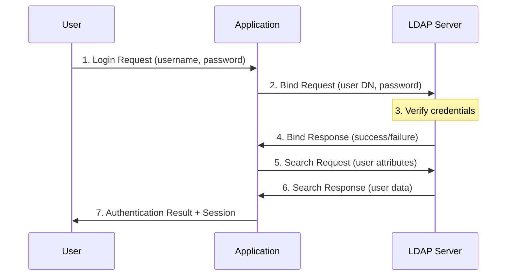

# LDAP Authentication

## Introduction to LDAP

Lightweight Directory Access Protocol (LDAP) is an open, vendor-neutral, industry standard application protocol for accessing and maintaining distributed directory information services over an Internet Protocol (IP) network. Directory services, like those based on LDAP, provide the means to organize and store information about users, systems, networks, services, and applications throughout an organization.

LDAP is not an authentication protocol itself, but rather a directory service that is commonly used for authentication and authorization purposes. It stores user credentials and attributes in a hierarchical database structure that can be queried by applications to verify user identities.

## Key Concepts in LDAP

### 1. Directory Structure

LDAP directories are organized in a hierarchical tree-like structure called the Directory Information Tree (DIT). The components of this structure include:

- **Entry**: A single unit in an LDAP directory, similar to a record in a database
- **Distinguished Name (DN)**: The unique identifier for an entry (e.g., `uid=john,ou=People,dc=example,dc=com`)
- **Relative Distinguished Name (RDN)**: The portion of the DN that identifies the entry within its immediate parent (e.g., `uid=john`)
- **Attributes**: Properties of an entry, consisting of a name and one or more values

### 2. LDAP Data Model Components

- **ObjectClasses**: Define what attributes an entry can or must contain
- **Attributes**: Specific pieces of information associated with an entry
- **Schemas**: Define the rules for data within the directory

### 3. LDAP Operations

LDAP supports various operations for interacting with the directory:
- **Bind**: Authenticates a client to the directory
- **Search**: Queries the directory for entries
- **Add**: Creates a new entry
- **Delete**: Removes an entry
- **Modify**: Changes attributes of an entry
- **Compare**: Tests if an entry contains a specific attribute value
- **Unbind**: Closes the connection

## LDAP Authentication Flow



### Step-by-Step Explanation:

1. **Login Initiation**:
   - User provides credentials (username and password) to the application

2. **LDAP Bind**:
   - Application constructs the user's Distinguished Name (DN)
   - Application attempts to bind to the LDAP server using the user's DN and password

3. **Credential Verification**:
   - LDAP server verifies the provided credentials against its directory

4. **Authentication Result**:
   - LDAP server returns success if credentials are valid, or failure if invalid

5. **User Information Retrieval** (Optional):
   - If authentication succeeds, the application typically performs a search to retrieve user attributes

6. **Attribute Delivery**:
   - LDAP server returns the requested user attributes

7. **Session Creation**:
   - Application creates a session for the authenticated user

## Advantages of LDAP Authentication

1. **Centralized User Management**: Maintain user accounts in a single location
2. **Scalability**: Can handle large organizations with millions of users
3. **Standardization**: Based on industry standards with widespread support
4. **Flexibility**: Can store various types of information beyond just authentication data
5. **Integration**: Works with numerous applications and systems

## Challenges with LDAP Authentication

1. **Complexity**: More complex to set up and maintain than simpler authentication systems
2. **Security Considerations**: Default configurations may transmit passwords in cleartext
3. **Management Overhead**: Requires ongoing administration
4. **Performance**: Can be resource-intensive with large directories
5. **Availability Concerns**: Requires planning for high availability

## Postgres Integration with LDAP

PostgreSQL can authenticate users against an LDAP directory, enabling centralized user management.

### Configuration Steps

1. **Install Required Packages**:
   ```bash
   sudo apt-get install libpq-dev libldap2-dev
   ```

2. **Configure PostgreSQL for LDAP Authentication**:

   Update `pg_hba.conf` to use LDAP authentication:
   ```
   # TYPE  DATABASE        USER            ADDRESS                 METHOD
   host    all             all             0.0.0.0/0               ldap ldapserver=ldap.example.com ldapprefix="uid=" ldapsuffix=",ou=People,dc=example,dc=com"
   ```

   For more advanced scenarios with LDAP search:
   ```
   host    all             all             0.0.0.0/0               ldap ldapserver=ldap.example.com ldapbasedn="ou=People,dc=example,dc=com" ldapsearchattribute=uid
   ```

3. **Restart PostgreSQL**:
   ```bash
   sudo systemctl restart postgresql
   ```

## Practical Exercise: Setting Up LDAP Authentication with PostgreSQL

### Prerequisites:
- A Linux system (Ubuntu/Debian shown in examples)
- Administrative access
- Basic familiarity with terminal commands

### Exercise 1: Install OpenLDAP and PostgreSQL

1. **Install Required Packages**:
   ```bash
   sudo apt-get update
   sudo apt-get install slapd ldap-utils postgresql postgresql-contrib
   ```
   During the slapd installation, you'll be prompted to set an administrator password.

2. **Reconfigure LDAP**:
   ```bash
   sudo dpkg-reconfigure slapd
   ```
   
   During reconfiguration:
   - DNS domain name: `example.com` (this becomes dc=example,dc=com)
   - Organization name: `Example Inc`
   - Administrator password: Enter a secure password
   - Database backend: MDB
   - Remove database when slapd is purged: No
   - Move old database: Yes

### Exercise 2: Configure LDAP Structure

1. **Create LDIF File for Base Structure**:
   ```bash
   nano base.ldif
   ```
   
   Add the following content:
   ```ldif
   # Create People OU
   dn: ou=People,dc=example,dc=com
   objectClass: organizationalUnit
   ou: People

   # Create Groups OU
   dn: ou=Groups,dc=example,dc=com
   objectClass: organizationalUnit
   ou: Groups
   ```

2. **Add Structure to LDAP**:
   ```bash
   ldapadd -x -D cn=admin,dc=example,dc=com -W -f base.ldif
   ```
   Enter the administrator password when prompted.

3. **Create LDIF File for Test User**:
   ```bash
   nano user.ldif
   ```
   
   Add the following content:
   ```ldif
   dn: uid=dbuser,ou=People,dc=example,dc=com
   objectClass: inetOrgPerson
   objectClass: posixAccount
   objectClass: shadowAccount
   uid: dbuser
   sn: User
   givenName: Database
   cn: Database User
   displayName: Database User
   uidNumber: 10000
   gidNumber: 10000
   userPassword: {SSHA}password_hash
   gecos: Database User
   loginShell: /bin/bash
   homeDirectory: /home/dbuser
   ```

4. **Generate SSHA Password Hash**:
   ```bash
   slappasswd -s your_password
   ```
   Replace `{SSHA}password_hash` in the user.ldif file with the generated hash.

5. **Add User to LDAP**:
   ```bash
   ldapadd -x -D cn=admin,dc=example,dc=com -W -f user.ldif
   ```

### Exercise 3: Configure PostgreSQL for LDAP Authentication

1. **Update PostgreSQL Client Authentication Configuration**:
   ```bash
   sudo nano /etc/postgresql/13/main/pg_hba.conf
   ```
   
   Add the following line:
   ```
   host    all             all             127.0.0.1/32            ldap ldapserver=localhost ldapprefix="uid=" ldapsuffix=",ou=People,dc=example,dc=com" ldapport=389
   ```

2. **Create the PostgreSQL User**:
   ```bash
   sudo -u postgres psql
   ```
   
   In the PostgreSQL prompt:
   ```sql
   CREATE USER dbuser;
   CREATE DATABASE testdb OWNER dbuser;
   \q
   ```

3. **Restart PostgreSQL**:
   ```bash
   sudo systemctl restart postgresql
   ```

### Exercise 4: Test LDAP Authentication

1. **Connect Using LDAP Authentication**:
   ```bash
   psql -h localhost -U dbuser -d testdb
   ```
   
   You should be prompted for the LDAP password for dbuser, not a PostgreSQL password.

2. **Create a Test Table**:
   Once connected, try creating a table to verify you have proper permissions:
   ```sql
   CREATE TABLE test (id serial PRIMARY KEY, name varchar);
   INSERT INTO test (name) VALUES ('LDAP Authentication Works!');
   SELECT * FROM test;
   ```

## Common Issues and Troubleshooting

1. **Connection Issues**:
   Check that the LDAP server is running:
   ```bash
   sudo systemctl status slapd
   ```

2. **Authentication Failures**:
   Verify LDAP connectivity:
   ```bash
   ldapsearch -x -b "dc=example,dc=com" -H ldap://localhost
   ```
   
   Test binding with the user:
   ```bash
   ldapwhoami -x -D "uid=dbuser,ou=People,dc=example,dc=com" -W
   ```

3. **PostgreSQL Configuration**:
   Check PostgreSQL logs for LDAP-related errors:
   ```bash
   sudo tail -f /var/log/postgresql/postgresql-13-main.log
   ```

4. **LDAP Search Issues**:
   If using ldapsearchattribute, verify the search works:
   ```bash
   ldapsearch -x -b "ou=People,dc=example,dc=com" "(uid=dbuser)"
   ```

## Advanced LDAP Authentication Scenarios

### 1. LDAP with TLS/SSL

For secure LDAP authentication, modify the pg_hba.conf entry:
```
host    all             all             0.0.0.0/0               ldap ldapserver=ldap.example.com ldapport=636 ldaptls=1 ldapprefix="uid=" ldapsuffix=",ou=People,dc=example,dc=com"
```

### 2. LDAP with Group-Based Authorization

PostgreSQL can be configured to check LDAP group membership:
```
host    all             +ldap_users     0.0.0.0/0               ldap ldapserver=ldap.example.com ldapbasedn="ou=People,dc=example,dc=com" ldapsearchattribute=uid
```

Then create a PostgreSQL group role:
```sql
CREATE ROLE ldap_users;
GRANT CONNECT ON DATABASE testdb TO ldap_users;
```

### 3. LDAP Attribute Mapping

Map LDAP attributes to PostgreSQL roles:
```sql
CREATE ROLE sales;
CREATE ROLE marketing;
CREATE ROLE engineering;
```

Then use LDAP attributes to determine role membership.

LDAP authentication provides a robust way to centralize user management across multiple systems and applications, including PostgreSQL databases. By implementing LDAP authentication, organizations can enforce consistent access controls and simplify user administration.
