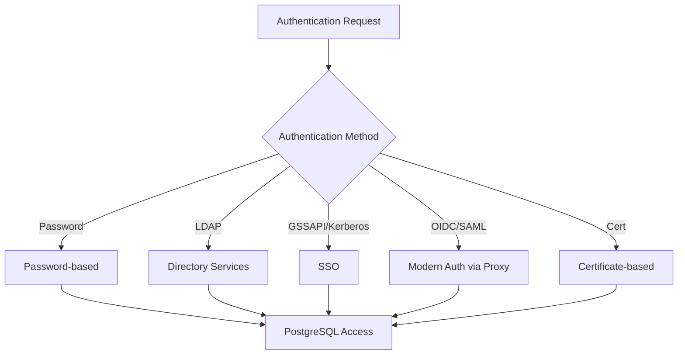
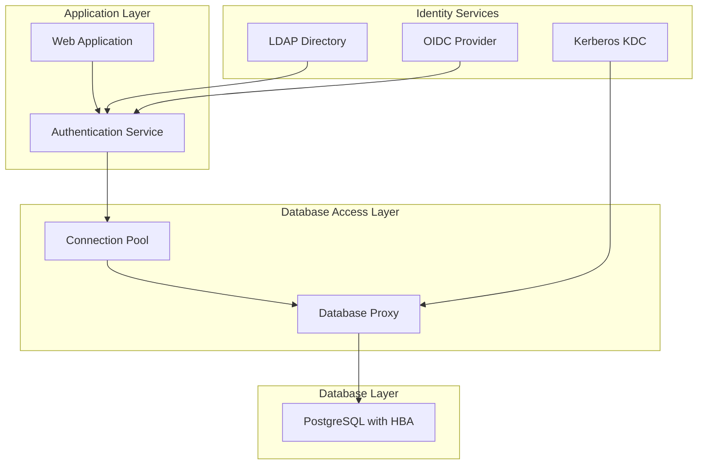
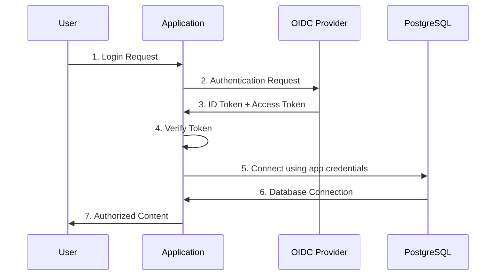
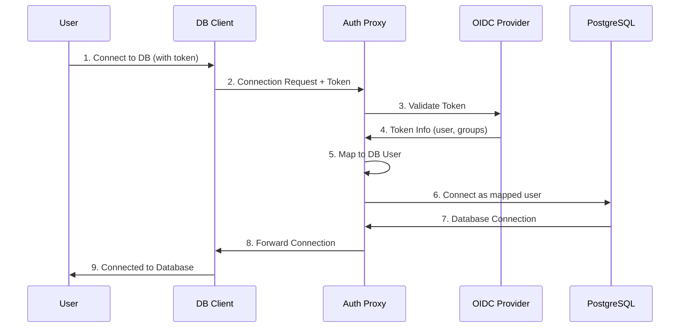
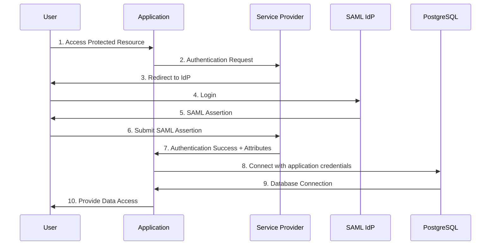

# PostgreSQL Authentication Integration

This guide explores how to integrate various authentication methods with PostgreSQL databases, providing a comprehensive approach to securing database access in different environments.

## Overview of PostgreSQL Authentication Methods

PostgreSQL supports multiple authentication methods, making it versatile for different security requirements. The authentication method is configured in the `pg_hba.conf` file (Host-Based Authentication).



## Common Authentication Methods for PostgreSQL

1. **Password Authentication**
   - `password`: Sends passwords in cleartext (insecure)
   - `md5`: Uses MD5-hashed passwords
   - `scram-sha-256`: Uses SCRAM-SHA-256 authentication (most secure password method)

2. **External Service Authentication**
   - `ldap`: Authenticates against an LDAP directory
   - `gss`: Kerberos/GSSAPI authentication
   - `pam`: Pluggable Authentication Modules

3. **Certificate Authentication**
   - `cert`: Uses SSL client certificates

4. **Integration with Modern Authentication** (via proxy or middleware)
   - OAuth 2.0 / OpenID Connect integration
   - SAML integration

## Implementing a Comprehensive Database Authentication Strategy

For a secure and scalable authentication system, a multi-layered approach is recommended:



## PostgreSQL with OIDC/OAuth 2.0 Integration

While PostgreSQL doesn't natively support OIDC authentication, you can implement it through:

### 1. Application-Level Integration

The most common approach - the application handles OIDC authentication and uses a service account to connect to PostgreSQL.



**Implementation Steps:**

1. **Configure Application for OIDC**:
   - Set up OIDC client in your application
   - Validate tokens and extract user information

2. **Database Connection Pool**:
   - Use connection pooling (pgBouncer, PgPool-II)
   - Apply role-based access control based on OIDC claims

3. **Example in Python (using Flask, Authlib and psycopg2)**:
   ```python
   import os
   from flask import Flask, session
   from authlib.integrations.flask_client import OAuth
   import psycopg2
   from psycopg2.pool import SimpleConnectionPool
   
   app = Flask(__name__)
   app.secret_key = os.getenv("SECRET_KEY")
   
   # OIDC setup
   oauth = OAuth(app)
   oauth.register(
       name='dex',
       # OIDC configuration...
   )
   
   # Database connection pool
   db_pool = SimpleConnectionPool(
       1, 20,
       dbname=os.getenv("DB_NAME"),
       user=os.getenv("DB_USER"),
       password=os.getenv("DB_PASSWORD"),
       host=os.getenv("DB_HOST")
   )
   
   @app.route('/data')
   def get_data():
       if 'user' not in session:
           return redirect('/login')
       
       # Get user roles from OIDC claims
       roles = session['user'].get('roles', [])
       
       # Get database connection from pool
       conn = db_pool.getconn()
       try:
           # Set session role based on OIDC claims
           with conn.cursor() as cur:
               if 'admin' in roles:
                   cur.execute("SET ROLE admin;")
               else:
                   cur.execute("SET ROLE basic_user;")
                   
               # Execute query
               cur.execute("SELECT * FROM protected_data;")
               data = cur.fetchall()
               return jsonify(data)
       finally:
           db_pool.putconn(conn)
   ```

### 2. Using a Database Proxy with OIDC Support

Products like [pgauthproxy](https://github.com/jkatz/pgauthproxy) or custom middleware can authenticate users with OIDC before connecting to PostgreSQL.



**Implementation Steps:**

1. **Set Up Authentication Proxy**:
   - Deploy pgauthproxy or similar solution
   - Configure OIDC client settings

2. **Configure Client Connection**:
   ```
   postgresql://proxy_host:proxy_port/dbname?authToken=<oidc_token>
   ```

3. **Configure User Mapping in Proxy**:
   Map OIDC claims (groups, roles) to PostgreSQL roles

## PostgreSQL with SAML Integration

Similar to OIDC, SAML integration typically happens at the application layer:



## Sample Integration: Dex with PostgreSQL and Python

This example demonstrates how to use Dex (OIDC provider) with PostgreSQL and a Python application:

### 1. Create PostgreSQL Roles and Permissions

```sql
-- Create application user
CREATE USER app_user WITH PASSWORD 'app_password';

-- Create roles for different access levels
CREATE ROLE readonly;
GRANT CONNECT ON DATABASE mydb TO readonly;
GRANT USAGE ON SCHEMA public TO readonly;
GRANT SELECT ON ALL TABLES IN SCHEMA public TO readonly;

CREATE ROLE readwrite;
GRANT CONNECT ON DATABASE mydb TO readwrite;
GRANT USAGE ON SCHEMA public TO readwrite;
GRANT SELECT, INSERT, UPDATE, DELETE ON ALL TABLES IN SCHEMA public TO readwrite;

CREATE ROLE admin;
GRANT CONNECT ON DATABASE mydb TO admin;
GRANT ALL PRIVILEGES ON DATABASE mydb TO admin;
GRANT ALL PRIVILEGES ON ALL TABLES IN SCHEMA public TO admin;

-- Grant app_user these roles
GRANT readonly TO app_user;
GRANT readwrite TO app_user;
GRANT admin TO app_user;
```

### 2. Create a Python Application with OIDC and PostgreSQL

```python
import os
from flask import Flask, redirect, url_for, session, request, render_template
from authlib.integrations.flask_client import OAuth
import psycopg2
from functools import wraps
from dotenv import load_dotenv

# Load environment variables
load_dotenv()

# Flask app setup
app = Flask(__name__)
app.secret_key = os.getenv("APP_SECRET_KEY")

# OAuth setup
oauth = OAuth(app)
oauth.register(
    name='dex',
    client_id=os.getenv("CLIENT_ID"),
    client_secret=os.getenv("CLIENT_SECRET"),
    server_metadata_url=f'{os.getenv("ISSUER_URL")}/.well-known/openid-configuration',
    client_kwargs={
        'scope': 'openid email profile groups'
    }
)

# Database connection function
def get_db_connection(role=None):
    conn = psycopg2.connect(
        dbname=os.getenv("DB_NAME"),
        user=os.getenv("DB_USER"),
        password=os.getenv("DB_PASSWORD"),
        host=os.getenv("DB_HOST")
    )
    if role:
        # Set role based on user groups from OIDC
        with conn.cursor() as cur:
            cur.execute(f"SET ROLE {role};")
    return conn

# Authentication decorator
def login_required(f):
    @wraps(f)
    def decorated_function(*args, **kwargs):
        if 'user' not in session:
            return redirect(url_for('login'))
        return f(*args, **kwargs)
    return decorated_function

# Routes
@app.route('/')
def home():
    user = session.get('user')
    return render_template('home.html', user=user)

@app.route('/login')
def login():
    redirect_uri = url_for('callback', _external=True)
    return oauth.dex.authorize_redirect(redirect_uri)

@app.route('/callback')
def callback():
    token = oauth.dex.authorize_access_token()
    user = oauth.dex.parse_id_token(token)
    session['user'] = user
    return redirect('/')

@app.route('/logout')
def logout():
    session.pop('user', None)
    return redirect('/')

@app.route('/data')
@login_required
def get_data():
    user = session['user']
    db_role = 'readonly'  # Default role
    
    # Map OIDC groups to database roles
    groups = user.get('groups', [])
    if 'admin' in groups:
        db_role = 'admin'
    elif 'editor' in groups:
        db_role = 'readwrite'
    
    try:
        conn = get_db_connection(db_role)
        cursor = conn.cursor()
        cursor.execute('SELECT * FROM users;')
        data = cursor.fetchall()
        column_names = [desc[0] for desc in cursor.description]
        cursor.close()
        conn.close()
        
        # Convert to list of dictionaries for easier templating
        result = [dict(zip(column_names, row)) for row in data]
        return render_template('data.html', data=result, role=db_role)
    except Exception as e:
        return f"Database error: {str(e)}"

if __name__ == '__main__':
    app.run(host='0.0.0.0', port=8000, debug=True)
```

### 3. Configuration in Dex

Ensure Dex is configured to provide group information in tokens:

```yaml
# Dex config.yaml addition
enablePasswordDB: true
staticPasswords:
- email: "admin@example.com"
  hash: "$2a$10$2b2cU8CPhOTaGrs1HRQuAueS7JTT5ZHsHSzYiFPm1leZck7Mc8T4W"
  username: "admin"
  userID: "08a8684b-db88-4b73-90a9-3cd1661f5466"
  groups:
  - "admin"

- email: "editor@example.com"
  hash: "$2a$10$2b2cU8CPhOTaGrs1HRQuAueS7JTT5ZHsHSzYiFPm1leZck7Mc8T4W"
  username: "editor"
  userID: "28a8684b-db88-4b73-90a9-3cd1661f5477"
  groups:
  - "editor"

- email: "viewer@example.com"
  hash: "$2a$10$2b2cU8CPhOTaGrs1HRQuAueS7JTT5ZHsHSzYiFPm1leZck7Mc8T4W"
  username: "viewer"
  userID: "38a8684b-db88-4b73-90a9-3cd1661f5488"
  groups:
  - "viewer"
```

## Practical Exercises: PostgreSQL Authentication Integration

### Exercise 1: Create a PostgreSQL Database with Role-Based Access Control

```sql
-- Connect to PostgreSQL
psql -U postgres

-- Create database
CREATE DATABASE authdb;
\c authdb

-- Create tables
CREATE TABLE public.users (
    id SERIAL PRIMARY KEY,
    username VARCHAR(50) UNIQUE NOT NULL,
    email VARCHAR(100) UNIQUE NOT NULL,
    created_at TIMESTAMP DEFAULT CURRENT_TIMESTAMP
);

CREATE TABLE public.sensitive_data (
    id SERIAL PRIMARY KEY,
    user_id INTEGER REFERENCES public.users(id),
    data TEXT NOT NULL,
    created_at TIMESTAMP DEFAULT CURRENT_TIMESTAMP
);

-- Create roles
CREATE ROLE app_readonly;
GRANT CONNECT ON DATABASE authdb TO app_readonly;
GRANT USAGE ON SCHEMA public TO app_readonly;
GRANT SELECT ON ALL TABLES IN SCHEMA public TO app_readonly;

CREATE ROLE app_readwrite;
GRANT CONNECT ON DATABASE authdb TO app_readwrite;
GRANT USAGE ON SCHEMA public TO app_readwrite;
GRANT SELECT, INSERT, UPDATE ON ALL TABLES IN SCHEMA public TO app_readwrite;
GRANT USAGE ON ALL SEQUENCES IN SCHEMA public TO app_readwrite;

CREATE ROLE app_admin;
GRANT CONNECT ON DATABASE authdb TO app_admin;
GRANT ALL PRIVILEGES ON SCHEMA public TO app_admin;
GRANT ALL PRIVILEGES ON ALL TABLES IN SCHEMA public TO app_admin;
GRANT ALL PRIVILEGES ON ALL SEQUENCES IN SCHEMA public TO app_admin;

-- Create users for different roles
CREATE USER viewer WITH PASSWORD 'viewer_pass';
GRANT app_readonly TO viewer;

CREATE USER editor WITH PASSWORD 'editor_pass';
GRANT app_readwrite TO editor;

CREATE USER admin_user WITH PASSWORD 'admin_pass';
GRANT app_admin TO admin_user;

-- Insert sample data
INSERT INTO public.users (username, email) VALUES
('john_doe', 'john@example.com'),
('jane_smith', 'jane@example.com'),
('admin_user', 'admin@example.com');

INSERT INTO public.sensitive_data (user_id, data) VALUES
(1, 'John''s sensitive information'),
(2, 'Jane''s sensitive information'),
(3, 'Admin''s sensitive information');
```

### Exercise 2: Integrate Authentication with a Python Flask Application

Create the following files in a project directory:

1. **requirements.txt**:
```
flask==2.0.1
psycopg2-binary==2.9.1
authlib==1.0.1
python-dotenv==0.19.1
requests==2.26.0
```

2. **.env**:
```
DB_HOST=localhost
DB_NAME=authdb
DB_USER=app_user
DB_PASSWORD=app_password
APP_SECRET_KEY=your-secret-key
CLIENT_ID=python-app
CLIENT_SECRET=python-app-secret
ISSUER_URL=http://localhost:5556/dex
```

3. **app.py** (with OIDC and PostgreSQL integration):
```python
# (Use the Python code from the previous example)
```

4. **templates/home.html**:
```html
<!DOCTYPE html>
<html>
<head>
    <title>DB Auth Demo</title>
    <style>
        body { font-family: Arial, sans-serif; margin: 40px; }
        .container { max-width: 800px; margin: 0 auto; }
        .card { border: 1px solid #ddd; padding: 20px; border-radius: 5px; }
        .btn { display: inline-block; padding: 10px 15px; background: #4285f4; color: white; 
               text-decoration: none; border-radius: 4px; }
    </style>
</head>
<body>
    <div class="container">
        <h1>Database Authentication Demo</h1>
        
            <div class="card">
                <h2>Logged in as {{ user.email }}</h2>
                <p>User ID: {{ user.sub }}</p>
                <p>Groups: {{ user.groups|join(', ') if user.groups else 'None' }}</p>
                <p><a href="/data" class="btn">View Database Data</a></p>
                <p><a href="/logout" class="btn">Logout</a></p>
            </div>
        
            <p>You are not logged in.</p>
            <p><a href="/login" class="btn">Login with Dex</a></p>
        
    </div>
</body>
</html>
```

5. **templates/data.html**:
```html
<!DOCTYPE html>
<html>
<head>
    <title>Database Data</title>
    <style>
        body { font-family: Arial, sans-serif; margin: 40px; }
        .container { max-width: 800px; margin: 0 auto; }
        table { width: 100%; border-collapse: collapse; }
        th, td { padding: 8px; text-align: left; border-bottom: 1px solid #ddd; }
        th { background-color: #f2f2f2; }
        .btn { display: inline-block; padding: 10px 15px; background: #4285f4; color: white; 
               text-decoration: none; border-radius: 4px; }
    </style>
</head>
<body>
    <div class="container">
        <h1>Database Data</h1>
        <p>You are accessing the database with the <strong>{{ role }}</strong> role.</p>
        
        <h2>Users Table</h2>
        <table>
            <thead>
                <tr>
                    
                    <th>{{ column }}</th>
                    
                </tr>
            </thead>
            <tbody>
                
                <tr>
                    
                    <td>{{ value }}</td>
                    
                </tr>
                
            </tbody>
        </table>
        
        <p><a href="/" class="btn">Back to Home</a></p>
    </div>
</body>
</html>
```

### Exercise 3: Testing Different Authentication Levels

1. **Setup the PostgreSQL App User**:
```sql
-- Create app user with ability to switch roles
CREATE USER app_user WITH PASSWORD 'app_password';
GRANT app_readonly TO app_user;
GRANT app_readwrite TO app_user;
GRANT app_admin TO app_user;
```

2. **Run the Application**:
```bash
pip install -r requirements.txt
python app.py
```

3. **Test with Different Users**:
   - Log in as viewer@example.com (read-only access)
   - Log in as editor@example.com (read-write access)
   - Log in as admin@example.com (admin access)

Observe how the same application maps different OIDC users to different PostgreSQL roles, providing appropriate database access levels based on user identity.

## Best Practices for PostgreSQL Authentication

1. **Principle of Least Privilege**
   - Assign the minimum necessary permissions to each role
   - Use role hierarchies for permission inheritance

2. **Connection Pooling**
   - Use a connection pool to manage database connections efficiently
   - Consider tools like pgBouncer or PgPool-II

3. **Secure Connection Settings**
   - Always use SSL/TLS for database connections
   - Configure `pg_hba.conf` to require SSL for remote connections

4. **Audit and Logging**
   - Enable PostgreSQL logging for authentication events
   - Implement audit logging for sensitive operations

5. **Rotation of Credentials**
   - Regularly rotate database passwords and service account credentials
   - Consider using a secrets management system for storing credentials

6. **Defense in Depth**
   - Layer authentication mechanisms for critical systems
   - Implement network-level security in addition to authentication

By combining modern authentication protocols like OIDC and SAML with PostgreSQL's robust security features, you can create a secure, scalable, and user-friendly authentication system for your database applications.
