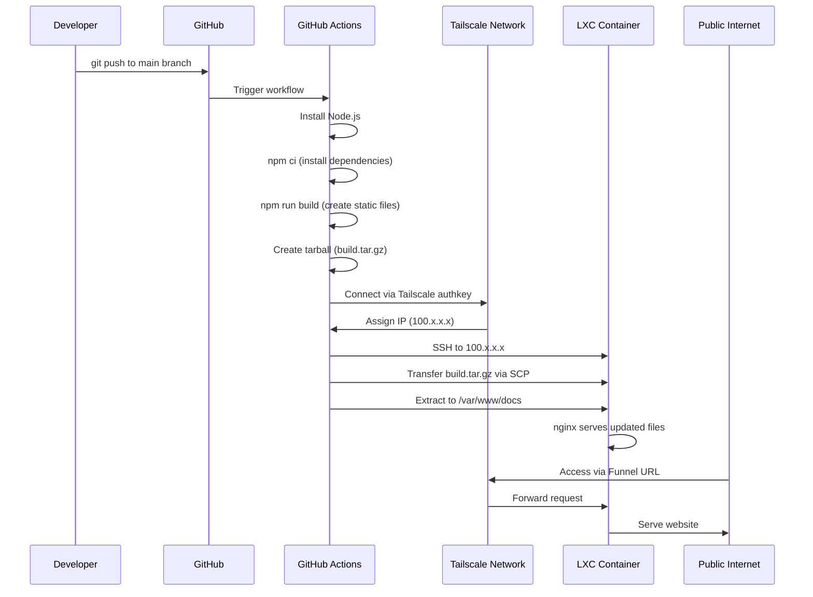

# Deploy Docusaurus on Proxmox LXC with Tailscale and GitHub Actions

Learn how to deploy a Docusaurus static documentation site on a Proxmox LXC container with automated CI/CD deployment using GitHub Actions and secure networking via Tailscale Funnel for public access.

:::info What You'll Build
- **LXC Container** running nginx serving Docusaurus static files
- **GitHub Actions CI/CD** that automatically builds and deploys on every commit
- **Tailscale** secure networking between GitHub Actions and your LXC
- **Tailscale Funnel** for public HTTPS access to your site
- **Zero manual deployment** after initial setup
:::

## Prerequisites

Before starting, ensure you have:

- **Proxmox VE** server with root access
- **GitHub repository** with Docusaurus project
- **Tailscale account** (free tier works)
- **Basic command-line knowledge**
- **SSH access** to your Proxmox host

**Tools used:**
- Proxmox VE 8.x
- Debian 13 LXC container
- nginx web server
- Node.js 20.x (for building)
- Tailscale VPN
- GitHub Actions

## Architecture Overview

Here's how the deployment pipeline works:



**Key benefits of this architecture:**
- ✅ No port forwarding or firewall configuration needed
- ✅ Secure encrypted connection via Tailscale
- ✅ Automatic deployment on every commit
- ✅ Public HTTPS access via Tailscale Funnel
- ✅ No Docker/Podman overhead (direct nginx serving)
- ✅ Minimal resource usage (~100MB RAM)

## Part 1: Create and Configure LXC Container

### Step 1: Find Available LXC Templates

First, check what container templates are available on your Proxmox host:

```bash
# SSH into Proxmox host
ssh root@proxmox-host

# List available templates
pveam list local

# If you don't have Debian 13, download it
pveam download local debian-13-standard_13.1-2_amd64.tar.zst
```

### Step 2: Create the LXC Container

Create a container named "docs" with appropriate resources:

```bash
# Create container (adjust CT ID, storage names for your setup)
pct create 300 local:vztmpl/debian-13-standard_13.1-2_amd64.tar.zst \
  --hostname docs \
  --cores 1 \
  --memory 512 \
  --rootfs data-containers:8 \
  --net0 name=eth0,bridge=vmbr0,ip=dhcp \
  --unprivileged 1

# Start the container
pct start 300

# Wait a few seconds for boot
sleep 5

# Get the container's IP address
pct exec 300 -- ip addr show eth0 | grep "inet "
```

**Note the IP address** - you'll need it later (e.g., `192.168.1.96`).

**Resource allocation explained:**
- **1 CPU core**: Sufficient for serving static files
- **512MB RAM**: Plenty for nginx (uses ~50-100MB)
- **8GB storage**: Adequate for OS + site files
- **Unprivileged**: More secure container isolation

### Step 3: Install and Configure nginx

Enter the container and set up the web server:

```bash
# Enter container console
pct enter 300

# Update system packages
apt update && apt upgrade -y

# Install nginx
apt install -y nginx curl

# Create web root directory
mkdir -p /var/www/docs

# Create nginx configuration
cat > /etc/nginx/sites-available/docs << 'EOF'
server {
    listen 80 default_server;
    listen [::]:80 default_server;
    
    root /var/www/docs;
    index index.html;
    
    server_name _;
    
    # Docusaurus SPA routing
    location / {
        try_files $uri $uri/ /index.html;
    }
    
    # Cache static assets
    location ~* \.(js|css|png|jpg|jpeg|gif|ico|svg|woff|woff2|ttf|eot)$ {
        expires 1y;
        add_header Cache-Control "public, immutable";
    }
    
    # Security headers
    add_header X-Frame-Options "SAMEORIGIN" always;
    add_header X-Content-Type-Options "nosniff" always;
    add_header X-XSS-Protection "1; mode=block" always;
}
EOF

# Enable the site (remove default)
rm /etc/nginx/sites-enabled/default
ln -s /etc/nginx/sites-available/docs /etc/nginx/sites-enabled/default

# Test nginx configuration
nginx -t

# Restart nginx
systemctl restart nginx
systemctl enable nginx

# Create a test page
echo "<h1>Docs Site - Ready for Deployment</h1>" > /var/www/docs/index.html

# Test locally
curl http://localhost

# Exit container
exit
```

Verify nginx is running:
```bash
# From Proxmox host
pct exec 300 -- systemctl status nginx
```

## Part 2: Set Up Tailscale Networking

### Step 4: Install Tailscale in LXC

Tailscale creates a secure mesh network between your LXC container and GitHub Actions runners.

```bash
# Enter container
pct enter 300

# Install Tailscale
curl -fsSL https://tailscale.com/install.sh | sh

# Start Tailscale (will display authentication URL)
tailscale up

# Copy the URL and open in browser to authenticate

# Get your Tailscale IP address
tailscale ip -4
# Example output: 100.124.241.22
# SAVE THIS IP - you'll need it for GitHub secrets

# Exit container
exit
```

:::tip Tailscale Authentication
When you run `tailscale up`, it displays a URL like `https://login.tailscale.com/a/...`. Open this URL in your browser and authenticate with your Tailscale account to authorize the device.
:::

### Step 5: Enable Tailscale Funnel (Public Access)

Tailscale Funnel allows you to expose your service to the public internet with HTTPS:

```bash
# In LXC container
pct exec 300 -- tailscale funnel 80

# Get your public Funnel URL
pct exec 300 -- tailscale funnel status
# Example output: https://docs-username.tailnet-name.ts.net
```

**What Funnel provides:**
- ✅ Public HTTPS access (automatic TLS certificate)
- ✅ No port forwarding needed
- ✅ DDoS protection via Tailscale
- ✅ Automatic certificate renewal
- ✅ Works behind NAT/firewall

## Part 3: Configure GitHub Actions Deployment

### Step 6: Generate SSH Keys for Deployment

On your local machine (Mac/Linux):

```bash
# Generate ED25519 SSH key pair
ssh-keygen -t ed25519 -C "github-actions-deploy" -f ~/.ssh/lxc-deploy -N ""

# Display the public key (copy this)
cat ~/.ssh/lxc-deploy.pub

# Display the private key (copy this - keep it secret!)
cat ~/.ssh/lxc-deploy
```

### Step 7: Add Public Key to LXC Container

From your Proxmox host:

```bash
# Create SSH directory in container
pct exec 300 -- mkdir -p /root/.ssh
pct exec 300 -- chmod 700 /root/.ssh

# Add public key (replace YOUR_PUBLIC_KEY with actual key)
pct exec 300 -- bash -c 'echo "YOUR_PUBLIC_KEY" >> /root/.ssh/authorized_keys'

# Set correct permissions
pct exec 300 -- chmod 600 /root/.ssh/authorized_keys
```

**Test SSH connection** from your local machine:

```bash
# Replace with your Tailscale IP from Step 4
ssh -i ~/.ssh/lxc-deploy root@100.124.241.22

# If it works without password, you're good!
exit
```

### Step 8: Generate Tailscale Auth Key

GitHub Actions needs an auth key to connect to your Tailscale network:

1. **Go to Tailscale Admin Console:**
   - Visit: https://login.tailscale.com/admin/settings/keys

2. **Generate auth key:**
   - Click **"Generate auth key"**
   - Settings:
     - Description: `GitHub Actions - Docusaurus Deploy`
     - Reusable: ✅ **Enable** (allows multiple workflow runs)
     - Ephemeral: ✅ **Enable** (node disappears after disconnect)
     - Tags: Leave blank
   - Click **"Generate"**

3. **Copy the auth key** (starts with `tskey-auth-...`)
   - Save it securely - you'll add it to GitHub next

### Step 9: Add Secrets to GitHub Repository

1. **Navigate to repository secrets:**
   - Go to: `https://github.com/YOUR_USERNAME/YOUR_REPO/settings/secrets/actions`

2. **Add four secrets** (click "New repository secret" for each):

**Secret #1: TAILSCALE_AUTHKEY**
```
Name: TAILSCALE_AUTHKEY
Value: tskey-auth-... (from Step 8)
```

**Secret #2: SSH_PRIVATE_KEY**
```
Name: SSH_PRIVATE_KEY
Value: (entire private key from ~/.ssh/lxc-deploy, including -----BEGIN and -----END lines)
```

**Secret #3: SSH_HOST**
```
Name: SSH_HOST
Value: 100.124.241.22 (your Tailscale IP from Step 4)
```

**Secret #4: SSH_USER**
```
Name: SSH_USER
Value: root
```

:::warning Keep Secrets Secure
Never commit secrets to your repository or share them publicly. GitHub secrets are encrypted and only accessible to workflows in your repository.
:::

### Step 10: Create GitHub Actions Workflow

Create the workflow file in your repository:

```bash
# In your Docusaurus project directory
mkdir -p .github/workflows
```

Create `.github/workflows/deploy-to-lxc.yml`:

```yaml
name: Build and Deploy to LXC

on:
  push:
    branches: [main]  # Change to 'master' if that's your default branch
  workflow_dispatch:  # Allows manual triggering

jobs:
  build-and-deploy:
    runs-on: ubuntu-latest
    
    steps:
      - name: Checkout code
        uses: actions/checkout@v4
      
      - name: Connect to Tailscale
        uses: tailscale/github-action@v2
        with:
          authkey: ${{ secrets.TAILSCALE_AUTHKEY }}
      
      - name: Setup Node.js
        uses: actions/setup-node@v4
        with:
          node-version: '20'
          cache: 'npm'
      
      - name: Install dependencies
        run: npm ci
      
      - name: Build Docusaurus site
        run: npm run build
      
      - name: Create tarball
        run: tar -czf build.tar.gz -C build .
      
      - name: Upload build artifact (backup)
        uses: actions/upload-artifact@v4
        with:
          name: docusaurus-build
          path: build.tar.gz
          retention-days: 7
      
      - name: Deploy to LXC via Tailscale
        env:
          SSH_PRIVATE_KEY: ${{ secrets.SSH_PRIVATE_KEY }}
          SSH_HOST: ${{ secrets.SSH_HOST }}
          SSH_USER: ${{ secrets.SSH_USER }}
        run: |
          # Setup SSH
          mkdir -p ~/.ssh
          echo "$SSH_PRIVATE_KEY" > ~/.ssh/deploy_key
          chmod 600 ~/.ssh/deploy_key
          
          # Add Tailscale host to known_hosts
          ssh-keyscan -H $SSH_HOST >> ~/.ssh/known_hosts 2>/dev/null || true
          
          # Copy build to LXC
          scp -i ~/.ssh/deploy_key -o StrictHostKeyChecking=no build.tar.gz ${SSH_USER}@${SSH_HOST}:/tmp/
          
          # Deploy on LXC
          ssh -i ~/.ssh/deploy_key -o StrictHostKeyChecking=no ${SSH_USER}@${SSH_HOST} << 'ENDSSH'
            cd /var/www/docs
            rm -rf * 2>/dev/null || true
            tar -xzf /tmp/build.tar.gz
            chown -R www-data:www-data /var/www/docs
            rm /tmp/build.tar.gz
            echo "✅ Deployment completed at $(date)"
          ENDSSH
```

**Workflow breakdown:**

| Step | Purpose | Duration |
|------|---------|----------|
| Checkout code | Download repository | 5s |
| Connect to Tailscale | Join secure network | 15s |
| Setup Node.js | Install Node.js 20 | 10s |
| Install dependencies | npm ci | 30-60s |
| Build site | npm run build | 60-120s |
| Create tarball | Compress build files | 5s |
| Upload artifact | Backup to GitHub | 10s |
| Deploy to LXC | Transfer & extract files | 10s |
| **Total** | **Full deployment** | **~3-4 min** |

## Part 4: Deploy and Test

### Step 11: Initial Deployment

Commit and push the workflow file:

```bash
# Stage the workflow file
git add .github/workflows/deploy-to-lxc.yml

# Commit
git commit -m "Add automated LXC deployment via GitHub Actions"

# Push to trigger deployment
git push origin main
```

### Step 12: Monitor Deployment

1. **Watch the workflow:**
   - Go to: `https://github.com/YOUR_USERNAME/YOUR_REPO/actions`
   - Click on the running workflow
   - Monitor each step's progress

2. **Expected output:**
   ```
   ✅ Checkout code
   ✅ Connect to Tailscale
   ✅ Setup Node.js
   ✅ Install dependencies (npm ci)
   ✅ Build Docusaurus site
   ✅ Create tarball
   ✅ Upload build artifact
   ✅ Deploy to LXC via Tailscale
   ```

3. **Deployment should complete in 3-4 minutes**

### Step 13: Verify Deployment

Test your deployed site:

```bash
# Via local IP (from your network)
curl -I http://192.168.1.96

# Via Tailscale IP (from any Tailscale device)
curl -I http://100.124.241.22

# Check deployment on LXC
ssh -i ~/.ssh/lxc-deploy root@100.124.241.22 'ls -la /var/www/docs'
```

**Access your site:**
- **Local network**: `http://192.168.1.96`
- **Tailscale network**: `http://100.124.241.22`
- **Public internet**: `https://docs-yourname.tailnet-name.ts.net`

## Troubleshooting Common Issues

### Issue 1: Workflow Fails at "Connect to Tailscale"

**Error:** `OAuth identity empty` or `Auth key invalid`

**Solution:**
```bash
# Verify secret name matches exactly (case-sensitive)
# Go to GitHub Secrets and check:
# - TAILSCALE_AUTHKEY exists
# - Value starts with tskey-auth-
# - No extra spaces or newlines

# Generate new auth key if needed:
# https://login.tailscale.com/admin/settings/keys
```

### Issue 2: SSH Connection Fails

**Error:** `Permission denied (publickey)`

**Solution:**
```bash
# Test SSH manually from local machine
ssh -i ~/.ssh/lxc-deploy root@100.124.241.22

# If fails, verify public key is in container
pct exec 300 -- cat /root/.ssh/authorized_keys

# Re-add public key if needed
pct exec 300 -- bash -c 'echo "YOUR_PUBLIC_KEY" > /root/.ssh/authorized_keys'
pct exec 300 -- chmod 600 /root/.ssh/authorized_keys
```

### Issue 3: 403 Forbidden on Website

**Error:** nginx returns 403 Forbidden

**Solution:**
```bash
# Check if files were deployed
pct exec 300 -- ls -la /var/www/docs

# Check file permissions
pct exec 300 -- chown -R www-data:www-data /var/www/docs
pct exec 300 -- chmod -R 755 /var/www/docs

# Verify index.html exists
pct exec 300 -- cat /var/www/docs/index.html
```

### Issue 4: Tailscale Funnel Not Working

**Error:** Funnel URL not accessible

**Solution:**
```bash
# Check Funnel status
pct exec 300 -- tailscale funnel status

# Restart Funnel
pct exec 300 -- tailscale funnel 80

# Verify Tailscale is running
pct exec 300 -- tailscale status

# Check nginx is listening on port 80
pct exec 300 -- ss -tlnp | grep :80
```

### Issue 5: Build Fails in GitHub Actions

**Error:** `npm ci` or `npm run build` fails

**Solution:**
```bash
# Test build locally first
npm ci
npm run build

# Check package.json for correct scripts
cat package.json | grep '"build"'

# Verify Node.js version compatibility
# Update workflow if needed:
# node-version: '20'  # Match your local version
```

### Debugging Commands

Use these commands to investigate issues:

```bash
# View GitHub Actions logs
# Go to: GitHub.com → Actions → Click workflow run

# Check nginx logs in LXC
pct exec 300 -- tail -f /var/log/nginx/error.log
pct exec 300 -- tail -f /var/log/nginx/access.log

# Check Tailscale connection
pct exec 300 -- tailscale status
pct exec 300 -- tailscale ping 100.x.x.x

# Test SSH from GitHub Actions runner IPs
# Use workflow debug step:
# - name: Debug SSH
#   run: |
#     ssh -vvv -i ~/.ssh/deploy_key root@$SSH_HOST

# Verify secrets are loaded
# Add to workflow (only for debugging, remove after):
# - name: Debug Secrets
#   run: |
#     echo "SSH_HOST: ${{ secrets.SSH_HOST }}"
#     echo "SSH_USER: ${{ secrets.SSH_USER }}"
```

## Maintenance and Operations

### Updating Your Site

After the initial setup, deployment is automatic:

```bash
# Make changes to your docs
vim docs/my-page.md

# Commit and push
git add .
git commit -m "Update documentation"
git push origin main

# GitHub Actions automatically:
# 1. Builds your site
# 2. Deploys to LXC
# 3. Site updates in ~3 minutes
```

### Manual Deployment

If needed, trigger deployment manually:

1. **Via GitHub UI:**
   - Go to: `GitHub.com → Actions → Build and Deploy to LXC`
   - Click **"Run workflow"**
   - Select branch and click **"Run workflow"**

2. **Download build artifact:**
   - In workflow run, scroll to "Artifacts"
   - Download `docusaurus-build`
   - Manually transfer to LXC if needed

### Backup Strategy

**Automated backups:**

```bash
# On Proxmox host - backup LXC container
vzdump 300 --mode snapshot --compress zstd --storage local

# Schedule with cron (daily at 2 AM)
echo "0 2 * * * vzdump 300 --mode snapshot --compress zstd --storage local" | crontab -
```

**Manual backup of site files:**

```bash
# From local machine
ssh -i ~/.ssh/lxc-deploy root@100.124.241.22 'tar -czf /tmp/docs-backup.tar.gz -C /var/www/docs .'
scp -i ~/.ssh/lxc-deploy root@100.124.241.22:/tmp/docs-backup.tar.gz ./docs-backup-$(date +%Y%m%d).tar.gz
```

### Monitoring

**Set up basic monitoring:**

```bash
# Create health check script in LXC
cat > /usr/local/bin/health-check.sh << 'EOF'
#!/bin/bash
if ! curl -f http://localhost > /dev/null 2>&1; then
    echo "Website down - restarting nginx"
    systemctl restart nginx
    echo "Website down at $(date)" >> /var/log/health-check.log
fi
EOF

chmod +x /usr/local/bin/health-check.sh

# Run every 5 minutes
echo "*/5 * * * * /usr/local/bin/health-check.sh" | crontab -
```

**Monitor deployment status:**

```bash
# Via GitHub CLI (install from github.com/cli/cli)
gh run list --repo YOUR_USERNAME/YOUR_REPO

# Watch latest run
gh run watch
```

### Resource Monitoring

Check LXC resource usage:

```bash
# From Proxmox host
pct status 300
pct config 300

# Memory usage
pct exec 300 -- free -h

# Disk usage
pct exec 300 -- df -h

# CPU usage
pct exec 300 -- top -bn1 | head -20
```

### Updating Container

Keep the LXC container updated:

```bash
# Enter container
pct enter 300

# Update packages
apt update && apt upgrade -y

# Update Tailscale
tailscale update

# Restart services if needed
systemctl restart nginx
systemctl restart tailscaled

exit
```

### Rotate SSH Keys

Periodically rotate deployment keys:

```bash
# Generate new keys
ssh-keygen -t ed25519 -C "github-actions-deploy-2026" -f ~/.ssh/lxc-deploy-new -N ""

# Add new public key to LXC
pct exec 300 -- bash -c 'echo "$(cat ~/.ssh/lxc-deploy-new.pub)" >> /root/.ssh/authorized_keys'

# Update GitHub secret SSH_PRIVATE_KEY with new private key

# Test deployment with new key

# Remove old key from LXC after confirming new key works
```

## Advanced Configuration

### Custom Domain with Tailscale

Use your own domain with Tailscale Funnel:

1. **Set up HTTPS certificate in Tailscale:**
   - Go to: https://login.tailscale.com/admin/dns
   - Enable HTTPS certificates
   - Add your domain

2. **Update Funnel configuration:**
   ```bash
   pct exec 300 -- tailscale funnel --https=443 --set-path=/ --bg 80
   ```

### Multiple Environments

Deploy to staging and production:

**Create staging container:**
```bash
pct create 301 local:vztmpl/debian-13-standard_13.1-2_amd64.tar.zst \
  --hostname docs-staging \
  --cores 1 \
  --memory 512 \
  --rootfs data-containers:8 \
  --net0 name=eth0,bridge=vmbr0,ip=dhcp \
  --unprivileged 1
```

**Create separate workflow:**
```yaml
# .github/workflows/deploy-staging.yml
on:
  push:
    branches: [develop]

# Use different secrets:
# - STAGING_SSH_HOST
# - STAGING_TAILSCALE_AUTHKEY
```

### Enable Gzip Compression

Improve performance with nginx compression:

```bash
pct exec 300 -- bash -c 'cat >> /etc/nginx/sites-available/docs << "EOF"

# Gzip compression
gzip on;
gzip_vary on;
gzip_proxied any;
gzip_comp_level 6;
gzip_types text/plain text/css text/xml text/javascript application/json application/javascript application/xml+rss application/rss+xml font/truetype font/opentype application/vnd.ms-fontobject image/svg+xml;
EOF'

pct exec 300 -- nginx -t
pct exec 300 -- systemctl reload nginx
```

### Add Deployment Notifications

Get notified when deployments complete:

```yaml
# Add to end of deploy-to-lxc.yml
- name: Notify deployment success
  if: success()
  run: |
    curl -X POST ${{ secrets.WEBHOOK_URL }} \
      -H "Content-Type: application/json" \
      -d '{"text":"✅ Deployment successful!"}'

- name: Notify deployment failure
  if: failure()
  run: |
    curl -X POST ${{ secrets.WEBHOOK_URL }} \
      -H "Content-Type: application/json" \
      -d '{"text":"❌ Deployment failed!"}'
```

## Security Best Practices

### Harden SSH Access

```bash
# In LXC container
cat >> /etc/ssh/sshd_config << 'EOF'

# Harden SSH
PermitRootLogin prohibit-password
PasswordAuthentication no
PubkeyAuthentication yes
MaxAuthTries 3
MaxSessions 2
EOF

systemctl restart sshd
```

### Firewall Rules

```bash
# In LXC container
apt install -y ufw

# Allow only necessary ports
ufw default deny incoming
ufw default allow outgoing
ufw allow 80/tcp    # HTTP
ufw allow from 100.0.0.0/8 to any port 22  # SSH only from Tailscale

ufw enable
```

### Regular Security Updates

```bash
# Enable automatic security updates
apt install -y unattended-upgrades
dpkg-reconfigure -plow unattended-upgrades

# Check configuration
cat /etc/apt/apt.conf.d/50unattended-upgrades
```

### Secret Rotation Schedule

Set reminders to rotate secrets:
- **SSH keys**: Every 6 months
- **Tailscale auth key**: Yearly
- **Review access logs**: Monthly

## Performance Optimization

### nginx Caching

```bash
# Add caching configuration
pct exec 300 -- bash -c 'cat >> /etc/nginx/sites-available/docs << "EOF"

# Browser caching
location ~* \.(html)$ {
    expires 1h;
    add_header Cache-Control "public, must-revalidate";
}

location ~* \.(json|xml)$ {
    expires 1d;
    add_header Cache-Control "public, must-revalidate";
}
EOF'

pct exec 300 -- systemctl reload nginx
```

### CDN Integration

For high traffic, add Cloudflare:

1. Point your domain to Tailscale Funnel URL
2. Enable Cloudflare proxy (orange cloud)
3. Configure caching rules in Cloudflare
4. Enable Brotli compression

### Resource Tuning

If experiencing high traffic:

```bash
# Increase LXC resources
pct set 300 --cores 2 --memory 1024

# Restart container
pct reboot 300

# Optimize nginx worker processes
pct exec 300 -- bash -c 'echo "worker_processes auto;" >> /etc/nginx/nginx.conf'
pct exec 300 -- systemctl reload nginx
```

## Comparison with Alternative Approaches

| Approach | Complexity | Cost | Scalability | Security |
|----------|------------|------|-------------|----------|
| **This Setup** (LXC + Tailscale) | Medium | Free | Medium | High |
| Docker on VPS | Medium | $5-10/mo | High | Medium |
| GitHub Pages | Low | Free | Very High | High |
| Netlify/Vercel | Low | Free-$20/mo | Very High | High |
| Kubernetes | High | $50+/mo | Very High | High |

**When to use this setup:**
- ✅ You already have Proxmox infrastructure
- ✅ Want full control over hosting
- ✅ Need integration with local network services
- ✅ Learning DevOps practices
- ✅ Free hosting preferred

**When to use alternatives:**
- ❌ Need global CDN (use Netlify/Vercel)
- ❌ No existing infrastructure (use GitHub Pages)
- ❌ Need extreme scalability (use cloud platform)

## Conclusion

You now have a fully automated documentation deployment pipeline that:

✅ Deploys on every commit to main branch  
✅ Builds in ~3 minutes from push to live  
✅ Requires zero manual intervention  
✅ Provides public HTTPS access via Tailscale Funnel  
✅ Runs securely on your own infrastructure  
✅ Costs nothing beyond your existing Proxmox server  

**Next steps:**
- Add custom domain to Tailscale Funnel
- Set up monitoring and alerts
- Configure automated backups
- Implement staging environment
- Add deployment notifications

:::tip Production Considerations
For production workloads, consider adding:
- Load balancer if scaling beyond one LXC
- Database backup automation
- Log aggregation (ELK stack)
- Uptime monitoring (UptimeRobot, Pingdom)
- Security scanning in CI/CD pipeline
:::

## Resources and References

**Official Documentation:**
- [Proxmox LXC Guide](https://pve.proxmox.com/wiki/Linux_Container)
- [Tailscale Documentation](https://tailscale.com/kb/)
- [GitHub Actions Docs](https://docs.github.com/en/actions)
- [Docusaurus Deployment](https://docusaurus.io/docs/deployment)
- [nginx Documentation](https://nginx.org/en/docs/)

**Community Resources:**
- [Tailscale Community Forum](https://forum.tailscale.com/)
- [Proxmox Forum](https://forum.proxmox.com/)
- [Docusaurus Discord](https://discord.gg/docusaurus)

**Monitoring Tools:**
- [Tailscale Admin Console](https://login.tailscale.com/admin)
- [GitHub Actions Dashboard](https://github.com/YOUR_USERNAME/YOUR_REPO/actions)

**Related Articles:**
- [journalctl Troubleshooting Guide](../linux/journalctl-troubleshooting-guide.md) - Debug LXC issues
- [Ansible Idempotency](ansible-idempotency.md) - Infrastructure automation

---

**Questions or issues?** Open an issue in the repository or consult the troubleshooting section above.
