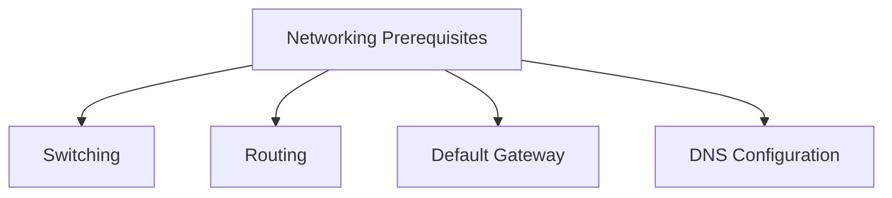
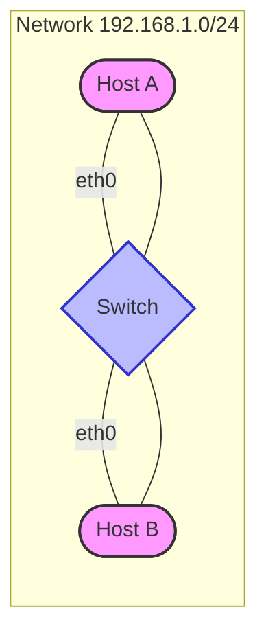
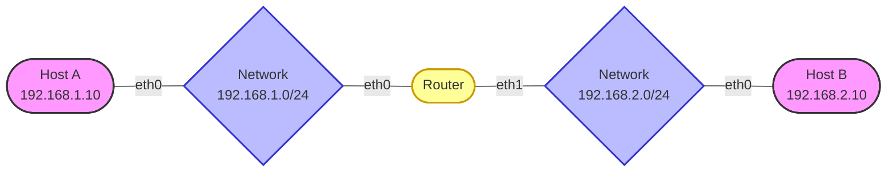
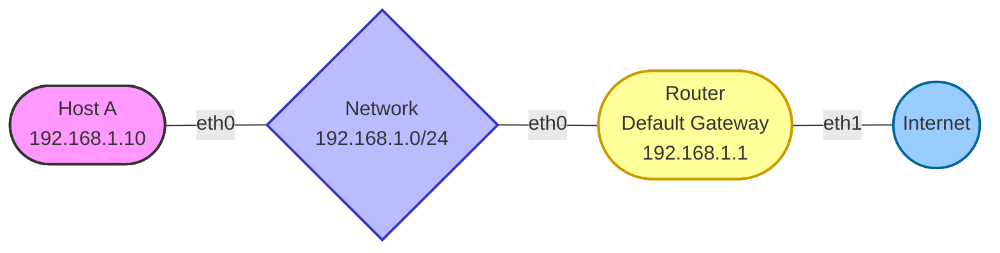
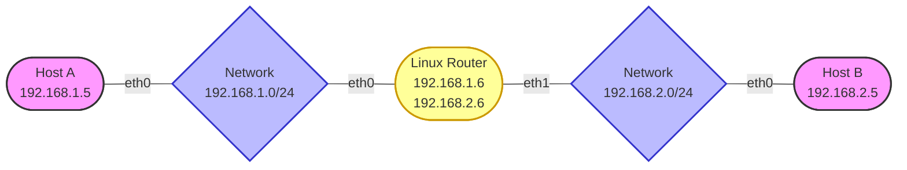
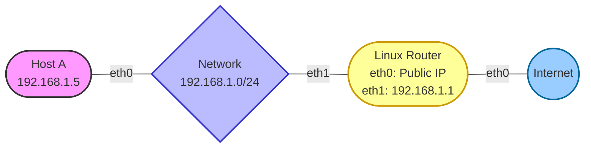

# Linux Networking: Concepts and Configuration

Linux provides powerful networking capabilities that allow it to function in various roles including client, server, router, firewall, and more. This guide covers essential networking concepts and practical configuration steps with hands-on lab exercises.

## Networking Prerequisites

Before diving into specific configurations, it's important to understand some fundamental networking concepts:



## Networking Components and Concepts

### Switches

A switch operates at the data link layer (Layer 2) of the OSI model and forwards traffic based on MAC addresses. Switches connect devices within the same network (same subnet).



In Linux, you can check network interface status using:

```bash
# Display interface information
ip link

# Show specific interface details
ip link show eth0
```

Example output:
```
eth0: <BROADCAST,MULTICAST,UP,LOWER_UP> mtu 1500 qdisc fq_codel state UP mode DEFAULT group default qlen 1000
```

### Routers

A router operates at the network layer (Layer 3) of the OSI model and forwards traffic between different networks based on IP addresses.



In Linux, you can view the routing table with:

```bash
# Display routing table
ip route

# Alternative command
route -n
```

Example output:
```
Kernel IP routing table
Destination     Gateway         Genmask         Flags Metric Ref    Use Iface
192.168.1.0     0.0.0.0         255.255.255.0   U     0      0        0 eth0
192.168.2.0     0.0.0.0         255.255.255.0   U     0      0        0 eth1
0.0.0.0         192.168.1.1     0.0.0.0         UG    0      0        0 eth0
```

### Gateway

A gateway is a device that connects different networks. The default gateway is where traffic is sent when its destination is outside the current network.



Configure a default gateway in Linux:

```bash
# Add a default gateway
ip route add default via 192.168.1.1

# Check the routing table
ip route
```

## Linux as a Router

Linux can function as a router by forwarding packets between different network interfaces. This is particularly useful for creating network gateways, firewalls, or VPN servers.

### IP Forwarding

IP forwarding allows a Linux machine to forward packets between its network interfaces. By default, this feature is disabled for security reasons.

Check IP forwarding status:

```bash
cat /proc/sys/net/ipv4/ip_forward
```

A return value of `0` means forwarding is disabled, while `1` means it's enabled.

To enable IP forwarding temporarily:

```bash
echo 1 > /proc/sys/net/ipv4/ip_forward
```

To enable IP forwarding permanently, edit `/etc/sysctl.conf`:

```bash
sudo nano /etc/sysctl.conf
```

Add or uncomment this line:
```
net.ipv4.ip_forward = 1
```

Apply the changes:

```bash
sudo sysctl -p
```

## Hands-on Networking Labs

The following lab exercises will help you practice Linux networking concepts. Each lab builds on the previous one to create a comprehensive understanding of network configuration.

### Lab 1: Basic Network Configuration

**Objective**: Configure basic networking on a Linux host

1. Check your network interfaces:
   ```bash
   ip addr
   ```

2. Configure a static IP address:
   ```bash
   sudo ip addr add 192.168.1.5/24 dev eth0
   ```

3. Bring up the interface:
   ```bash
   sudo ip link set eth0 up
   ```

4. Verify connectivity to another host on the same network:
   ```bash
   ping 192.168.1.10
   ```

5. Make the configuration persistent by editing network configuration files:
   
   For Ubuntu/Debian (Netplan):
   ```bash
   sudo nano /etc/netplan/01-netcfg.yaml
   ```
   
   ```yaml
   network:
     version: 2
     renderer: networkd
     ethernets:
       eth0:
         addresses:
           - 192.168.1.5/24
   ```
   
   Apply Netplan configuration:
   ```bash
   sudo netplan apply
   ```
   
   For CentOS/RHEL:
   ```bash
   sudo nano /etc/sysconfig/network-scripts/ifcfg-eth0
   ```
   
   ```
   DEVICE=eth0
   BOOTPROTO=static
   IPADDR=192.168.1.5
   NETMASK=255.255.255.0
   ONBOOT=yes
   ```
   
   Restart networking:
   ```bash
   sudo systemctl restart network
   ```

### Lab 2: Setting up a Router Between Two Networks

**Objective**: Configure a Linux host to route traffic between two networks

**Setup**: A Linux machine with two network interfaces (eth0 and eth1)



1. Configure the router's interfaces:
   ```bash
   # First interface
   sudo ip addr add 192.168.1.6/24 dev eth0
   sudo ip link set eth0 up
   
   # Second interface
   sudo ip addr add 192.168.2.6/24 dev eth1
   sudo ip link set eth1 up
   ```

2. Enable IP forwarding:
   ```bash
   sudo sh -c "echo 1 > /proc/sys/net/ipv4/ip_forward"
   ```

3. Verify the interfaces are configured correctly:
   ```bash
   ip addr
   ```

4. On Host A (192.168.1.5), add a route to reach Network 2:
   ```bash
   sudo ip route add 192.168.2.0/24 via 192.168.1.6
   ```

5. On Host B (192.168.2.5), add a route to reach Network 1:
   ```bash
   sudo ip route add 192.168.1.0/24 via 192.168.2.6
   ```

6. Test connectivity from Host A to Host B:
   ```bash
   ping 192.168.2.5
   ```

7. If ping fails, check if IP forwarding is enabled on the router:
   ```bash
   cat /proc/sys/net/ipv4/ip_forward
   ```

8. Make the configuration persistent as described in Lab 1.

### Lab 3: Setting up Network Address Translation (NAT)

**Objective**: Configure a Linux router to provide internet access to an internal network

**Setup**: A Linux router with two interfaces: eth0 connected to the internet and eth1 connected to the internal network



1. Configure interfaces on the router:
   ```bash
   # Internet-facing interface (assume DHCP for the public IP)
   sudo dhclient eth0
   
   # Internal network interface
   sudo ip addr add 192.168.1.1/24 dev eth1
   sudo ip link set eth1 up
   ```

2. Enable IP forwarding:
   ```bash
   sudo sh -c "echo 1 > /proc/sys/net/ipv4/ip_forward"
   ```

3. Configure NAT using iptables:
   ```bash
   sudo iptables -t nat -A POSTROUTING -o eth0 -j MASQUERADE
   sudo iptables -A FORWARD -i eth1 -o eth0 -j ACCEPT
   sudo iptables -A FORWARD -i eth0 -o eth1 -m state --state RELATED,ESTABLISHED -j ACCEPT
   ```

4. Make iptables rules persistent:
   
   For Ubuntu/Debian:
   ```bash
   sudo apt-get install iptables-persistent
   sudo netfilter-persistent save
   ```
   
   For CentOS/RHEL:
   ```bash
   sudo yum install iptables-services
   sudo service iptables save
   ```

5. On Host A, set the default gateway:
   ```bash
   sudo ip route add default via 192.168.1.1
   ```

6. Test internet connectivity from Host A:
   ```bash
   ping 8.8.8.8
   ```

### Lab 4: DNS Configuration

**Objective**: Configure DNS on a Linux network

1. Check the current DNS configuration:
   ```bash
   cat /etc/resolv.conf
   ```

2. Configure DNS temporarily:
   ```bash
   sudo sh -c "echo 'nameserver 8.8.8.8' > /etc/resolv.conf"
   sudo sh -c "echo 'nameserver 8.8.4.4' >> /etc/resolv.conf"
   ```

3. For persistent DNS configuration on Ubuntu/Debian using Netplan:
   ```bash
   sudo nano /etc/netplan/01-netcfg.yaml
   ```
   
   ```yaml
   network:
     version: 2
     renderer: networkd
     ethernets:
       eth0:
         addresses:
           - 192.168.1.5/24
         nameservers:
           addresses: [8.8.8.8, 8.8.4.4]
   ```
   
   Apply Netplan configuration:
   ```bash
   sudo netplan apply
   ```

4. For CentOS/RHEL:
   ```bash
   sudo nano /etc/sysconfig/network-scripts/ifcfg-eth0
   ```
   
   Add these lines:
   ```
   DNS1=8.8.8.8
   DNS2=8.8.4.4
   ```
   
   Restart networking:
   ```bash
   sudo systemctl restart network
   ```

5. Test DNS resolution:
   ```bash
   ping google.com
   ```

### Lab 5: Network Diagnostics

**Objective**: Learn to diagnose network issues

1. Check interface status:
   ```bash
   ip link
   ```

2. Verify IP configuration:
   ```bash
   ip addr
   ```

3. Test local connectivity:
   ```bash
   ping 127.0.0.1
   ```

4. Check the routing table:
   ```bash
   ip route
   ```

5. Trace the route to a destination:
   ```bash
   traceroute google.com
   ```

6. Check open ports and connections:
   ```bash
   ss -tuln
   ```

7. Test connectivity to a specific port:
   ```bash
   telnet google.com 80
   ```
   
   Or using netcat:
   ```bash
   nc -zv google.com 80
   ```

8. Display network statistics:
   ```bash
   netstat -s
   ```

9. Check DNS resolution:
   ```bash
   dig google.com
   ```

## Advanced Networking Topics

### Traffic Control with tc

Linux offers traffic control capabilities through the `tc` command, allowing you to shape bandwidth, prioritize traffic, and more.

Example: Limit bandwidth to 1Mbps on eth0:

```bash
sudo tc qdisc add dev eth0 root tbf rate 1mbit burst 32kbit latency 400ms
```

### Network Namespaces

Network namespaces allow you to create isolated network environments within a single Linux system.

Create a network namespace:

```bash
sudo ip netns add red
```

Execute commands within the namespace:

```bash
sudo ip netns exec red ip addr
```

### Virtual Network Interfaces

Create a virtual Ethernet pair:

```bash
sudo ip link add veth0 type veth peer name veth1
```

Move one end to a namespace:

```bash
sudo ip link set veth1 netns red
```

Configure the interfaces:

```bash
sudo ip addr add 192.168.3.1/24 dev veth0
sudo ip link set veth0 up

sudo ip netns exec red ip addr add 192.168.3.2/24 dev veth1
sudo ip netns exec red ip link set veth1 up
```

### Linux Bridge

Create a bridge interface:

```bash
sudo ip link add name br0 type bridge
sudo ip link set br0 up
```

Add interfaces to the bridge:

```bash
sudo ip link set eth0 master br0
sudo ip link set eth1 master br0
```

## Summary

Linux provides a comprehensive set of networking tools and capabilities, allowing it to function effectively in various network roles. Understanding the concepts covered in this guide—switching, routing, gateways, and IP forwarding—forms the foundation of Linux network administration.

The hands-on labs offer practical experience with configuring interfaces, setting up routing, implementing NAT, and diagnosing network issues. By mastering these skills, you'll be able to design, implement, and troubleshoot complex Linux-based network infrastructures.

## Further Reading

- [Linux Advanced Routing & Traffic Control HOWTO](https://lartc.org/)
- [Red Hat Enterprise Linux Networking Guide](https://access.redhat.com/documentation/en-us/red_hat_enterprise_linux/7/html/networking_guide/index)
- [Linux Network Administrators Guide](https://www.tldp.org/LDP/nag2/index.html)
- [IP Command Cheat Sheet](https://access.redhat.com/sites/default/files/attachments/rh_ip_command_cheatsheet_1214_jcs_print.pdf)
