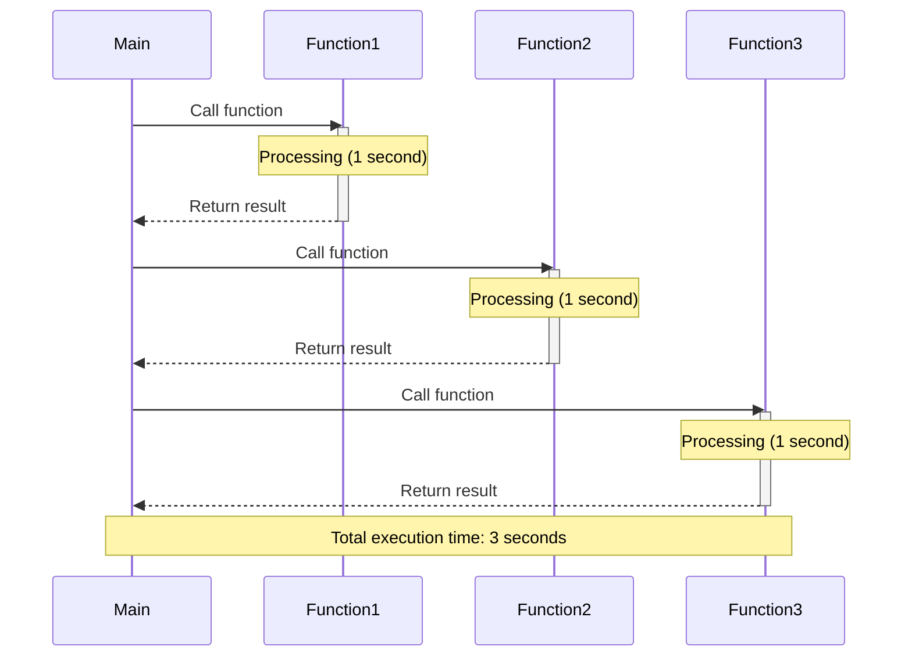
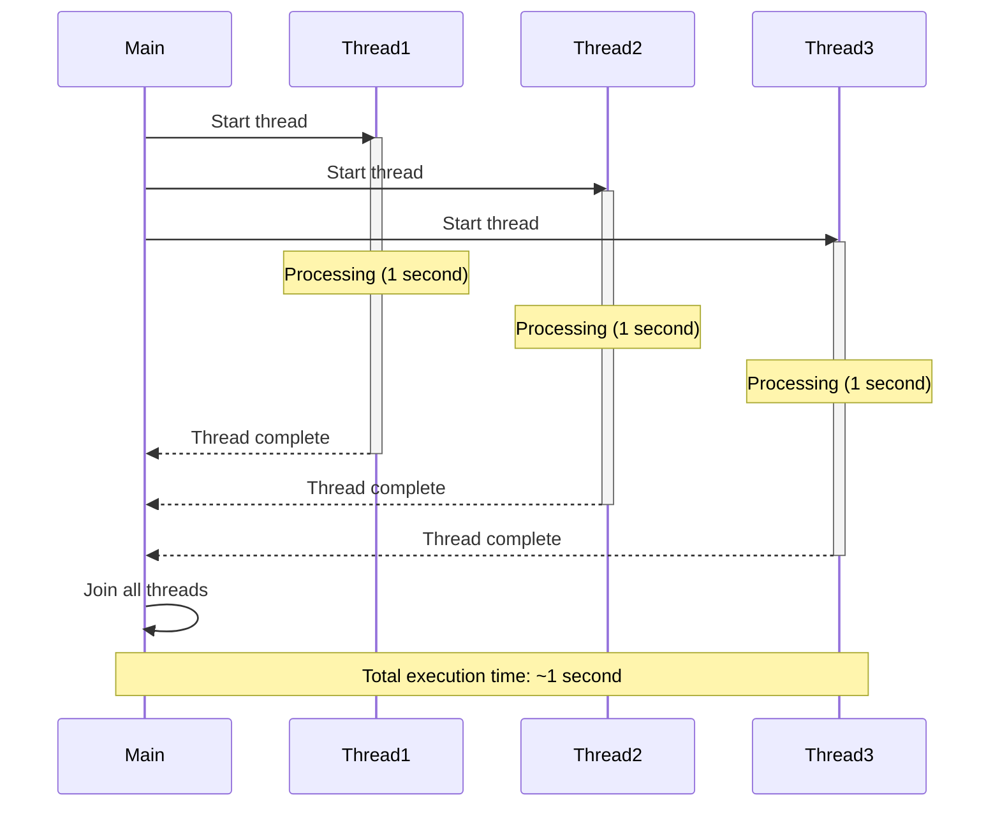
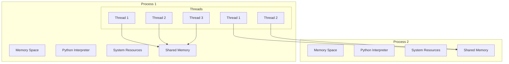
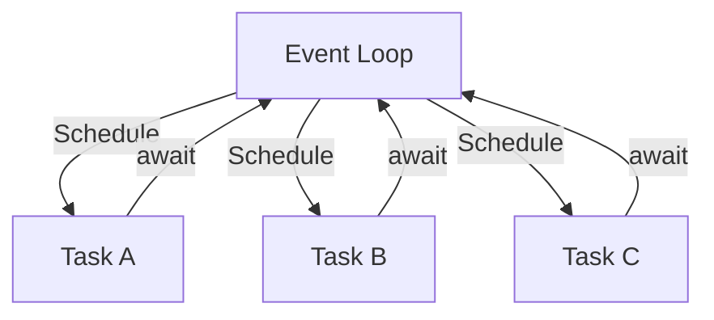
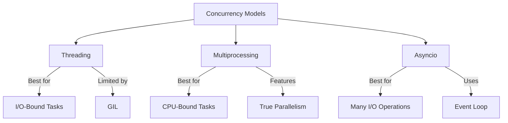

# Python Threading Guide

## Introduction

Threading is a technique for running multiple operations concurrently within a single process. In Python, threading is particularly useful for I/O-bound tasks where operations spend significant time waiting for external resources (network requests, file operations, etc.). This guide covers Python's threading capabilities, from basic thread creation to advanced thread management with the `concurrent.futures` module.

## Threading vs Multiprocessing: When to Use Each

- **Threading**: Use for I/O-bound tasks (network requests, file operations, database queries)
- **Multiprocessing**: Use for CPU-bound tasks (complex calculations, data processing)

> **Why the difference?**  
> Due to Python's Global Interpreter Lock (GIL), only one thread can execute Python code at once. This means threading doesn't provide true parallelism for CPU-bound tasks, but it's very effective for I/O-bound tasks where threads spend time waiting.

## Basic Threading: Using the `threading` Module

### Creating and Starting Threads

The most basic way to use threads is with the `threading.Thread` class:

```python
import threading
import time

def do_something():
    print('Sleeping 5 seconds')
    time.sleep(5)
    print('Done sleeping')

# Create thread objects
thread1 = threading.Thread(target=do_something)
thread2 = threading.Thread(target=do_something)

# Start threads
thread1.start()
thread2.start()
```

### Waiting for Threads with `join()`

The `join()` method allows the main thread to wait for the completion of other threads:

```python
# Start threads
thread1.start()
thread2.start()

# Wait for threads to complete
thread1.join()
thread2.join()

print('All threads completed')
```

### Passing Arguments to Thread Functions

You can pass arguments to the target function using the `args` parameter (for positional arguments) or `kwargs` (for keyword arguments):

```python
def do_something(seconds):
    print(f'Sleeping {seconds} seconds')
    time.sleep(seconds)
    print('Done sleeping')

# Pass arguments as a list
thread = threading.Thread(target=do_something, args=[2])
# Or as a tuple
thread = threading.Thread(target=do_something, args=(2,))
```

### Creating Multiple Threads

You can create and manage multiple threads with a list:

```python
threads = []

# Create and start 10 threads
for _ in range(10):
    thread = threading.Thread(target=do_something, args=[2])
    thread.start()
    threads.append(thread)

# Wait for all threads to complete
for thread in threads:
    thread.join()
```

## Advanced Threading: `concurrent.futures`

The `concurrent.futures` module provides a high-level interface for asynchronously executing callables, introduced in Python 3.2.

### ThreadPoolExecutor

The `ThreadPoolExecutor` manages a pool of worker threads, distributing tasks to available threads as they become available:

```python
import concurrent.futures
import time

def do_something(seconds):
    print(f'Sleeping {seconds} second')
    time.sleep(seconds)
    return f'Done sleeping {seconds}'

# Using context manager to ensure cleanup
with concurrent.futures.ThreadPoolExecutor() as executor:
    seconds = [5, 4, 3, 2, 1]
    results = executor.map(do_something, seconds)
    
    for result in results:
        print(result)
```

### The `submit()` Method and Futures

The `submit()` method schedules a function to be executed and returns a `Future` object representing the execution:

```python
with concurrent.futures.ThreadPoolExecutor() as executor:
    # Schedule execution and get Future objects
    f1 = executor.submit(do_something, 5)
    f2 = executor.submit(do_something, 4)
    
    # Future.result() blocks until the result is available
    print(f1.result())
    print(f2.result())
```

### Processing Completed Futures with `as_completed()`

The `as_completed()` function yields futures as they complete, which is useful when you want to process results as soon as they're ready:

```python
with concurrent.futures.ThreadPoolExecutor() as executor:
    seconds = [5, 4, 3, 2, 1]
    futures = [executor.submit(do_something, sec) for sec in seconds]
    
    for future in concurrent.futures.as_completed(futures):
        print(future.result())
```

### Comparing `map()` and `submit()`

- **`map()`**: Simpler syntax, results are returned in the same order as inputs
- **`submit()`**: More flexible, allows using `as_completed()` to process results as they finish

## Thread Execution Visualization

### Sequential Execution

In sequential execution, each function call must complete before the next one begins, resulting in the total execution time being the sum of all individual execution times.



### Concurrent Execution

With concurrent execution using threads, multiple functions can run simultaneously. For I/O-bound tasks, this significantly reduces the total execution time.



## Timing Thread Execution

To measure execution time, use `time.perf_counter()`:

```python
import time
import concurrent.futures

start = time.perf_counter()

# Thread execution code here...

finish = time.perf_counter()
print(f'Finished in {round(finish-start, 2)} second(s)')
```

## Practical Example: Downloading Images with Threads

For I/O-bound tasks like downloading multiple images, threads can significantly improve performance:

```python
import requests
import time
import concurrent.futures

img_urls = [
    'https://images.unsplash.com/photo-1516117172878-fd2c41f4a759',
    'https://images.unsplash.com/photo-1532009324734-20a7a5813719',
    'https://images.unsplash.com/photo-1524429656589-6633a470097c',
    'https://images.unsplash.com/photo-1530224264768-7ff8c1789d79',
    'https://images.unsplash.com/photo-1564135624576-c5c88640f235',
    'https://images.unsplash.com/photo-1541698444083-023c97d3f4b6',
    'https://images.unsplash.com/photo-1522364723953-452d3431c267',
    'https://images.unsplash.com/photo-1513938709626-033611b8cc03',
    'https://images.unsplash.com/photo-1507143550189-fed454f93097',
    'https://images.unsplash.com/photo-1493976040374-85c8e12f0c0e'
]

def download_image(img_url):
    img_bytes = requests.get(img_url).content
    img_name = img_url.split('/')[3]
    img_name = f'{img_name}.jpg'
    with open(img_name, 'wb') as img_file:
        img_file.write(img_bytes)
        print(f'{img_name} was downloaded...')

start = time.perf_counter()

with concurrent.futures.ThreadPoolExecutor() as executor:
    executor.map(download_image, img_urls)
    
finish = time.perf_counter()
print(f'Finished in {round(finish-start, 2)} second(s)')
```

## Thread Synchronization

When threads access shared resources, synchronization is necessary to prevent race conditions.

### Using Locks

```python
import threading
import time

counter = 0
lock = threading.Lock()

def increment_counter():
    global counter
    with lock:  # Automatically acquires and releases the lock
        local_counter = counter
        time.sleep(0.1)  # Simulate some processing
        counter = local_counter + 1
        print(f'Counter: {counter}')

threads = []
for _ in range(10):
    thread = threading.Thread(target=increment_counter)
    threads.append(thread)
    thread.start()

for thread in threads:
    thread.join()

print(f'Final counter: {counter}')
```

### Other Synchronization Primitives

Python's `threading` module provides several synchronization primitives:

1. **Semaphore**: Limits access to a shared resource to a fixed number of threads
   ```python
   semaphore = threading.Semaphore(value=2)  # Allow 2 threads at once
   ```

2. **Event**: Signals between threads
   ```python
   event = threading.Event()
   # In one thread
   event.set()  # Signal the event
   # In another thread
   event.wait()  # Wait for the event
   ```

3. **Condition**: More complex signaling between threads
   ```python
   condition = threading.Condition()
   # Notify waiting threads
   with condition:
       condition.notify_all()
   ```

4. **Queue**: Thread-safe queue for producer-consumer patterns
   ```python
   from queue import Queue
   task_queue = Queue()
   task_queue.put(item)  # Producer
   item = task_queue.get()  # Consumer
   ```

## The Global Interpreter Lock (GIL)

Python's GIL is a mutex that protects access to Python objects, preventing multiple threads from executing Python bytecode simultaneously. Important points about the GIL:

- Only one thread can execute Python code at a time
- I/O operations release the GIL, allowing other threads to run
- CPU-bound operations rarely release the GIL
- C extensions can release the GIL during execution
- The GIL is why threading is good for I/O-bound tasks but less effective for CPU-bound tasks

## Best Practices

1. **Use thread pools** (`ThreadPoolExecutor`) instead of manually creating threads
2. **Prefer `with` statement** for context management
3. **Use thread synchronization** when accessing shared resources
4. **Keep the GIL in mind** - threading is best for I/O-bound tasks
5. **Consider using asyncio** for newer code if appropriate
6. **Be careful with thread termination** - threads should exit cleanly
7. **Benchmark your code** - measure the actual performance improvement from threading

## Common Pitfalls

1. **Race conditions** - Use proper synchronization for shared resources
2. **Deadlocks** - Be careful when acquiring multiple locks
3. **Thread leakage** - Always join threads or use context managers
4. **Over-threading** - Too many threads can cause overhead
5. **Using threading for CPU-bound tasks** - Consider multiprocessing instead
6. **Thread safety** - Be careful with non-thread-safe libraries

## Multiprocessing in Python

Multiprocessing involves running multiple processes, each with its own Python interpreter and memory space. This allows for true parallelism, making multiprocessing ideal for CPU-bound tasks that need to bypass the Global Interpreter Lock (GIL).

### Basic Multiprocessing

```python
import multiprocessing
import time

def worker(name):
    print(f"Worker {name} starting")
    time.sleep(2)  # Simulate some work
    print(f"Worker {name} finished")

if __name__ == '__main__':  # This guard is important for Windows
    processes = []
    for i in range(5):
        p = multiprocessing.Process(target=worker, args=(i,))
        processes.append(p)
        p.start()
    
    for p in processes:
        p.join()  # Wait for all processes to finish
```

### Process Pools with `concurrent.futures`

Similar to thread pools, you can use `ProcessPoolExecutor` for managing a pool of worker processes:

```python
import concurrent.futures
import time

def cpu_bound_task(number):
    return sum(i * i for i in range(number))

if __name__ == '__main__':
    numbers = [10000000 + x for x in range(8)]
    
    start = time.perf_counter()
    
    with concurrent.futures.ProcessPoolExecutor() as executor:
        results = executor.map(cpu_bound_task, numbers)
    
    finish = time.perf_counter()
    print(f'Finished in {round(finish-start, 2)} second(s)')
```

### Process vs Thread Visualization



The diagram above illustrates that:
- Each process has its own memory space, Python interpreter, and system resources
- Threads exist within a process
- Threads within the same process share memory
- Different processes have separate memory spaces

## Asynchronous Programming with Asyncio

Asyncio is a Python library for writing concurrent code using the `async/await` syntax. It's designed for I/O-bound tasks and uses an event loop to manage and schedule tasks.

### Key Concepts in Asyncio

1. **Coroutines**: Functions defined with `async def`. These are the building blocks of asyncio.
2. **Event Loop**: The core of asyncio that manages the execution of tasks.
3. **Tasks**: Wrappers around coroutines that are scheduled on the event loop.
4. **await**: Pauses the execution of a coroutine, yielding control back to the event loop.

### Basic Asyncio Example

```python
import asyncio

async def task(name):
    print(f"Task {name} starting")
    await asyncio.sleep(2)  # Simulate an I/O-bound operation
    print(f"Task {name} finished")
    return f"Result from {name}"

async def main():
    # Run multiple coroutines concurrently
    results = await asyncio.gather(
        task("A"),
        task("B"),
        task("C")
    )
    print(results)

# In Python 3.7+
asyncio.run(main())
```

### Event Loop Visualization



### Creating and Managing Tasks

```python
import asyncio

async def my_coroutine():
    await asyncio.sleep(2)
    return "Done"

async def main():
    # Create a task and start it immediately
    task = asyncio.create_task(my_coroutine())
    
    # Do other work while the task runs
    print("Doing something else while waiting...")
    
    # Wait for the task to complete
    result = await task
    print(f"Task result: {result}")

asyncio.run(main())
```

### Handling CPU-Bound Tasks in Asyncio

Asyncio is not well-suited for CPU-bound tasks because they can block the event loop. However, you can offload CPU-bound tasks to a separate thread or process:

```python
import asyncio
import time

def cpu_bound_task(n):
    time.sleep(n)  # Simulating a CPU-bound task
    return n * n

async def main():
    # Offload to a separate thread
    result = await asyncio.to_thread(cpu_bound_task, 2)
    print(f"Result: {result}")

asyncio.run(main())
```

### Comparing Concurrency Models



## When to Use Each Approach

1. **Multithreading**:
   - Best for I/O-bound tasks like network operations or file I/O
   - Use when you need shared state between threads
   - Not ideal for CPU-bound tasks due to the GIL

2. **Multiprocessing**:
   - Ideal for CPU-bound tasks that need true parallelism
   - Use when you need to bypass the GIL
   - Best for heavy computational workloads

3. **Asyncio**:
   - Excellent for I/O-bound tasks with many concurrent operations
   - Ideal for building high-performance network servers
   - More readable and maintainable than callback-based approaches
   - Not suitable for CPU-bound tasks without offloading

## Further Resources

- [Python Threading Documentation](https://docs.python.org/3/library/threading.html)
- [concurrent.futures Documentation](https://docs.python.org/3/library/concurrent.futures.html)
- [Real Python's Threading Guide](https://realpython.com/intro-to-python-threading/)
- [Python Multiprocessing vs Threading](https://realpython.com/python-concurrency/)
- [Python Asyncio Tutorial](https://realpython.com/async-io-python/)
- [Python Cookbook: Concurrency](https://www.oreilly.com/library/view/python-cookbook-3rd/9781449357337/)
- [Fluent Python: Concurrency Chapter](https://www.oreilly.com/library/view/fluent-python/9781491946237/)

## Next Steps

After mastering these concurrency models, consider exploring:
- **Hybrid approaches** combining asyncio with threads or processes
- **Distributed computing** frameworks like Dask or Celery
- **Thread-safe data structures** in the `queue` and `collections.concurrent` modules
- **Advanced synchronization patterns** like producer-consumer and thread pools
