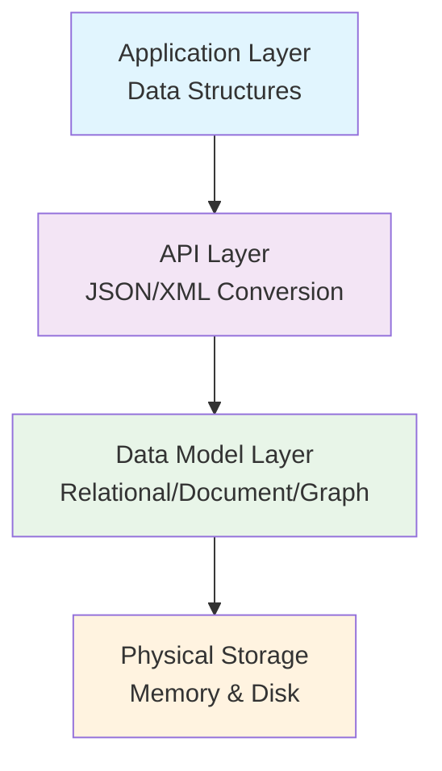
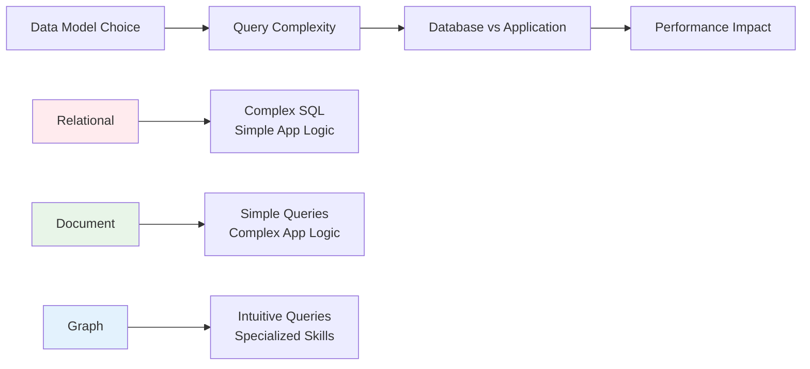

# Data Modeling

> "Abstraction basically is the right amount of information that conveys enough meaning but not too much meaning either."

Data modeling is the process of creating abstractions that represent real-world objects and their relationships in a structured way. The choice of data model fundamentally impacts how you store, retrieve, and query your data.

## Abstraction Layers

### System Architecture

### Layer Responsibilities
- **Application Layer**: Uses data structures for real-world objects like users
- **API Layer**: Provides abstraction, converting objects to JSON or XML
- **Data Model Layer**: Defines how relationships and data are structured
- **Physical Storage**: Represents the deepest abstraction of physical storage

> "Each of these layers serve the layer above it."

## Data Model Paradigms

### Relational Model
**Structure**: Tables with foreign keys defining entity relationships

**Characteristics**:
- **Schema-on-write**: Enforces rigid schema at database level
- **Data consistency**: Strong integrity guarantees
- **Complex joins**: SQL queries often require multiple table joins
- **Many-to-many**: Excels at representing complex relationships

**Use Case**: Financial systems, inventory management, applications requiring strong consistency

### Document Model
**Structure**: Stores related data together (user with embedded posts)

**Characteristics**:
- **Schema-on-read**: Flexible schemas enforced at application level
- **Data locality**: Simplifies retrieving all data for one entity
- **High write throughput**: Optimized for specific access patterns
- **Application complexity**: Complex queries move to application layer

**Use Case**: Content management, user profiles, catalog systems

### Graph Model
**Structure**: Nodes and edges representing relationships

**Characteristics**:
- **Intuitive relationships**: Natural representation of connections
- **Many-to-many**: Ideal for interconnected data
- **Query flexibility**: Traversal-based queries
- **Relationship focus**: Optimized for relationship queries

**Use Case**: Social networks, recommendation engines, fraud detection

## Model Comparison

### Query Complexity Trade-offs

### Schema Management

#### Schema-on-Write (Relational)
- **Validation**: Data validated before storage
- **Consistency**: Guaranteed data structure
- **Evolution**: Schema migrations required
- **Performance**: Optimized for query performance

#### Schema-on-Read (NoSQL)
- **Flexibility**: Easy to evolve data structure
- **Validation**: Application-level validation
- **Development**: Faster iteration cycles
- **Complexity**: Handling varied data formats

## Design Considerations

### Core Decision Factors
> "Data storage, data retrieval are two main things to consider."

1. **Data Relationships**: How entities connect to each other
2. **Query Patterns**: How data will be accessed
3. **Consistency Requirements**: Data integrity needs
4. **Scalability Needs**: Growth expectations
5. **Development Velocity**: Speed of iteration requirements

### Access Pattern Analysis

#### One-to-Many (Tree Structures)
- **Document Model**: Natural fit
- **Example**: User with posts, categories with items
- **Benefit**: Data locality, single-document retrieval

#### Many-to-Many (Complex Networks)
- **Graph Model**: Optimal choice
- **Example**: Social networks, organizational charts
- **Benefit**: Efficient relationship traversal

#### Structured Relationships (Business Logic)
- **Relational Model**: Strong consistency
- **Example**: Financial transactions, inventory
- **Benefit**: Data integrity, complex queries

## Technology Choices

### Relational Databases
- **PostgreSQL**: Advanced features, extensibility
- **MySQL**: Popular, well-supported
- **Oracle**: Enterprise-grade, comprehensive
- **SQL Server**: Microsoft ecosystem integration

### Document Databases
- **MongoDB**: Flexible schema, rich features
- **Couchbase**: Performance-focused, caching
- **DynamoDB**: AWS integration, scalability

### Graph Databases
- **Neo4j**: Property graph model, Cypher query language
- **Amazon Neptune**: AWS managed, multiple graph models
- **ArangoDB**: Multi-model, flexible

## Hybrid Approaches

### Polyglot Persistence
> "There is no one size that fits all."

**Strategy**: Use multiple data stores for different use cases

**Examples**:
- **User profiles**: Document database
- **Financial transactions**: Relational database
- **Social connections**: Graph database
- **Analytics**: Time-series database

### Implementation Patterns
- **Data synchronization**: Keep multiple stores consistent
- **Service decomposition**: Different services use different stores
- **Query routing**: Route queries to appropriate store
- **Data aggregation**: Combine data from multiple sources

## Object-Relational Mapping

### The Impedance Mismatch
**Problem**: Object-oriented code doesn't naturally map to relational tables

**Solutions**:
- **ORM Frameworks**: Hibernate, SQLAlchemy, Entity Framework
- **Data transfer objects**: Map between objects and tables
- **Repository pattern**: Abstract data access
- **Query builders**: Generate SQL from object queries

### Trade-offs
- **Development speed**: Faster with ORMs
- **Performance**: May be slower than raw SQL
- **Complexity**: Additional layer to manage
- **Debugging**: Harder to debug generated queries

## Evolution Strategies

### Schema Evolution
- **Relational**: Migration scripts, version control
- **Document**: Application-level validation, backward compatibility
- **Graph**: Schemaless, but consistent node/edge types

### Data Migration
- **Gradual migration**: Run both systems in parallel
- **Data transformation**: Convert between formats
- **Validation**: Ensure data integrity
- **Rollback planning**: Ability to revert changes

## Best Practices

### Model Selection
> "Your use case, your application use case, you'll have to determine what data model works best."

1. **Analyze query patterns**: Understand how data will be accessed
2. **Consider relationships**: Evaluate data connection complexity
3. **Plan for growth**: Design for future scalability
4. **Team skills**: Consider team expertise
5. **Ecosystem factors**: Tool and library availability

### Implementation Guidelines
- **Start simple**: Begin with basic model, evolve as needed
- **Test thoroughly**: Validate with real data and queries
- **Monitor performance**: Track query performance over time
- **Plan for migration**: Design for future changes
- **Document decisions**: Record model choice rationale

## Key Takeaways

### Core Principles
1. **No universal solution**: Each model has optimal use cases
2. **Query-model coupling**: Data model determines query complexity
3. **Trade-off awareness**: Every choice involves compromises
4. **Use-case driven**: Business requirements guide model selection
5. **Hybrid approaches**: Modern systems often combine models

### Decision Framework
> "If your data model is simple, then you will have to write simpler queries."

1. **Simple relationships**: Consider document model
2. **Complex relationships**: Consider relational or graph model
3. **High interconnectedness**: Graph model excels
4. **Strong consistency**: Relational model provides guarantees
5. **Rapid iteration**: Document model offers flexibility

---

**Key Takeaway**: Understanding your specific business problem and access patterns is key to selecting the right data model, as there is no technological silver bullet—only solutions fitted to specific contexts.
