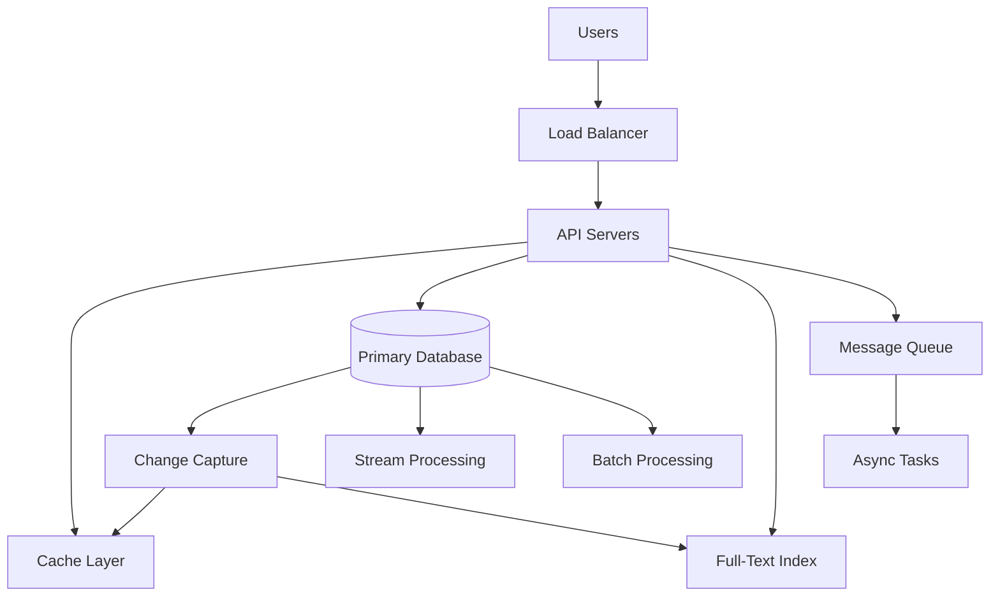

# Data-Intensive Applications

> "The role of the application developer is to design data systems for reliability, scalability, and maintainability."

Data-intensive applications are systems that generate or use vast, rapidly changing data volumes. Major websites like LinkedIn, Facebook, and Google are classic examples that require specialized architectural approaches.

## System Architecture Overview

### Component Architecture

### Key Components

#### Load Balancing Layer
- **Purpose**: Distribute traffic across multiple servers
- **Scale**: Handle millions of concurrent users
- **Reliability**: Route traffic away from failed instances

#### Application Servers
- **Authentication & Authorization**: Security checks before processing
- **Business Logic**: Core application functionality
- **Data Orchestration**: "Glue" between different data stores

#### Cache Layer
- **Technologies**: Memcached, Redis, Couchbase
- **Purpose**: Fast read operations to improve response times
- **Strategy**: Cache frequently accessed data
- **Cache Miss**: Update primary database and propagate changes

#### Primary Database
- **Role**: Ultimate source of truth
- **Technologies**: Oracle, MySQL, PostgreSQL
- **Consistency**: Strong data guarantees
- **Durability**: Persistent storage

#### Search Indexes
- **Technology**: Apache Lucene, Elasticsearch
- **Purpose**: Fast keyword and faceted searches
- **Use Cases**: Full-text search across large datasets
- **Updates**: Synchronized via change capture

#### Message Queues
- **Technology**: Kafka, RabbitMQ
- **Purpose**: Asynchronous task processing
- **Examples**: Email sending, notifications
- **Benefits**: Decouples user actions from heavy processing

## Core System Pillars

### 1. Reliability
> "Reliability is fault tolerance from human, software, or hardware faults."

Reliability is the non-negotiable foundation upon which all user trust is built.

#### Fault Tolerance Strategies
- **Hardware Failure**: Design for full machine failure
- **Software Failure**: Graceful degradation and recovery
- **Human Error**: Automated testing and staging environments
- **Quick Rollback**: Ability to revert changes rapidly

#### Chaos Engineering
> "Deliberately doing chaos testing helps with finding out issues in the system."

- **Proactive Testing**: Introduce failures deliberately
- **System Weaknesses**: Uncover hidden issues
- **Regular Cadence**: Hardware components fail regularly
- **Resilience**: Build systems that thrive under failure

### 2. Scalability
> "Scalability ensures systems can scale with higher traffic volume and complexity."

Scalability is not a feature but a core property of the system's initial design.

#### Load Characterization
- **Peak Reads**: Maximum read operations per second
- **Peak Writes**: Maximum write operations per second
- **Concurrent Users**: Simultaneous active users
- **Data Volume**: Total data size and growth rate

#### Scaling Strategies

##### Scaling Up (Vertical)
- **Definition**: More powerful machines
- **Benefits**: Simpler architecture
- **Limitations**: Hardware constraints, cost
- **Use Case**: Small to medium applications

##### Scaling Out (Horizontal)
- **Definition**: Distribute load across multiple machines
- **Benefits**: Unlimited scaling potential
- **Complexity**: Distributed system challenges
- **Use Case**: Large-scale applications

#### Performance Metrics
- **Online Systems**: Prioritize response time
- **Offline Systems**: Prioritize throughput
- **End-to-End Monitoring**: Measure true perceived performance
- **Service Level Objectives**: 90th/95th percentile metrics

> "Remember that the end users response time includes your server response time."

### 3. Maintainability
> "Maintainability hinges on systems being operable, simple, and easy to evolve."

Maintainability determines the long-term velocity and adaptability of a development team.

#### Operability
- **Monitoring**: Easy system health monitoring
- **Configuration**: Simple configuration overrides
- **Troubleshooting**: Efficient problem diagnosis
- **Automation**: Reduce manual intervention

#### Simplicity
- **Clean Code**: Established design patterns
- **Documentation**: Comprehensive system documentation
- **Abstractions**: Better and better abstractions over time
- **Team Onboarding**: Easy for new developers to ramp up

#### Evolvability
- **Technical Debt**: Regular refactoring to reduce debt
- **Feature Addition**: Easy to add new features
- **Issue Resolution**: Simple to fix problems
- **Adaptation**: Respond to changing requirements

## Data Processing Patterns

### Stream Processing
- **Purpose**: Near real-time data aggregation
- **Technology**: Apache Samza, Kafka Streams
- **Use Cases**: Real-time analytics, monitoring
- **Latency**: Milliseconds to seconds

### Batch Processing
- **Purpose**: Large-scale data processing
- **Technology**: Apache Spark, Hadoop
- **Use Cases**: Data analytics, reporting
- **Latency**: Minutes to hours

### Change Data Capture
- **Purpose**: Synchronize data between systems
- **Implementation**: Database triggers or log parsing
- **Updates**: Cache and index maintenance
- **Consistency**: Keep all systems in sync

## Architectural Trade-offs

### Performance vs Consistency
- **Strong Consistency**: Higher latency, simpler reasoning
- **Eventual Consistency**: Lower latency, complex reasoning
- **Use Case**: Business requirements drive the choice

### Complexity vs Simplicity
- **Distributed Systems**: Better scalability, more complexity
- **Monolithic Systems**: Simpler deployment, limited scaling
- **Team Size**: Match complexity to team capabilities

### Cost vs Performance
- **Hardware**: More powerful machines cost more
- **Development**: Complex systems require more engineering
- **Operations**: Distributed systems need more monitoring

## Best Practices

### Design Principles
- **Assume Failure**: Design for component failures
- **Measure Everything**: Monitor end-to-end performance
- **Automate**: Reduce manual intervention
- **Test Continuously**: Include chaos testing

### Operational Excellence
- **Capacity Planning**: Regular uplifts for traffic growth
- **Performance Monitoring**: Track high percentiles
- **Rollback Strategy**: Quick and reliable rollback capability
- **Documentation**: Keep system documentation current

### Development Practices
- **Clean Architecture**: Maintainable code structure
- **Regular Refactoring**: Improve abstractions over time
- **Code Reviews**: Ensure quality and consistency
- **Knowledge Sharing**: Enable team growth

## Technology Choices

### Caching
- **Memcached**: Simple key-value caching
- **Redis**: Advanced data structures and persistence
- **Couchbase**: Distributed caching with persistence

### Databases
- **Relational**: Oracle, MySQL, PostgreSQL
- **NoSQL**: MongoDB, Cassandra, DynamoDB
- **Search**: Elasticsearch, Solr

### Messaging
- **Kafka**: High-throughput stream processing
- **RabbitMQ**: Traditional message queuing
- **SQS**: Cloud-based queuing service

### Processing
- **Stream**: Apache Samza, Kafka Streams
- **Batch**: Apache Spark, Hadoop
- **Hybrid**: Apache Flink

## Key Takeaways

> "There is no one magic solution for building a high scalable system."

- **Custom Solutions**: Every system is unique to its use case
- **Core Pillars**: Reliability, scalability, maintainability
- **Continuous Evolution**: Systems must adapt over time
- **Team Focus**: Build systems your team can operate and evolve

> "Based on your use case, your solution will be custom to your needs. You will build the right systems."

---

**Key Takeaway**: Building data-intensive applications requires focusing on reliability as the foundation, scalability for growth, and maintainability for long-term team velocity, with every architectural decision being a deliberate trade-off tailored to your specific use case.
